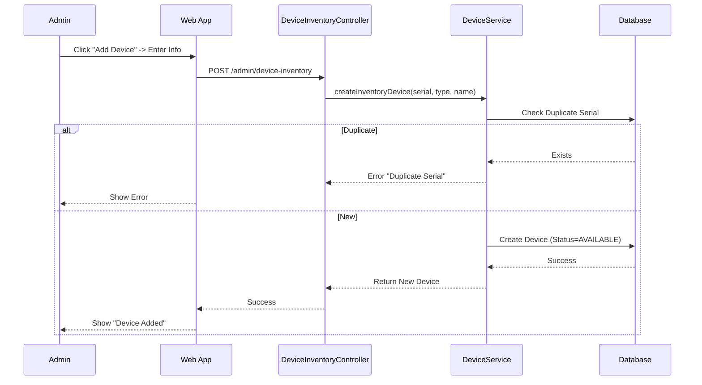
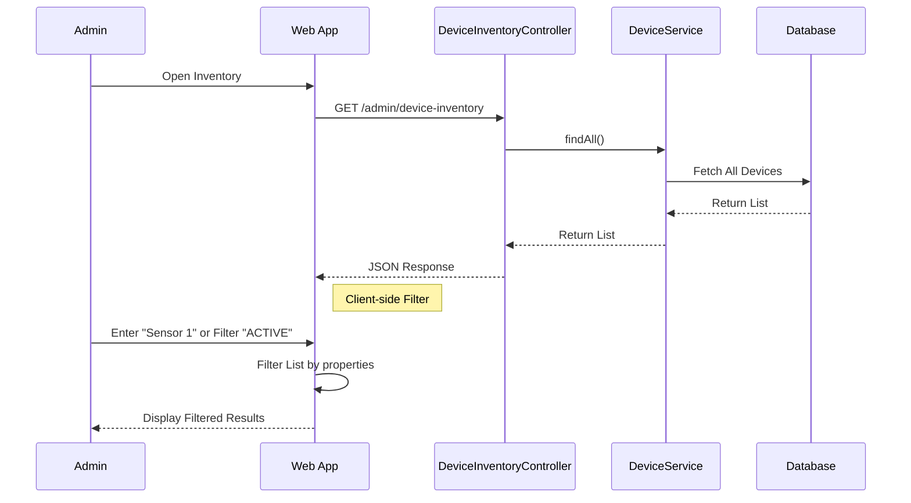
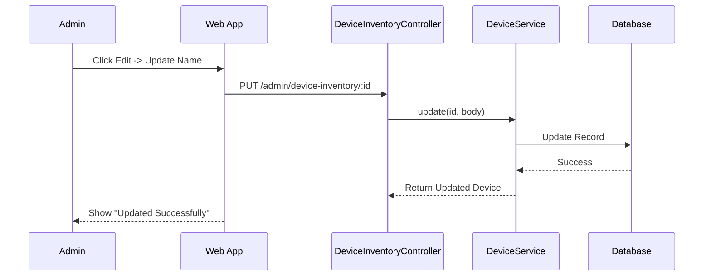
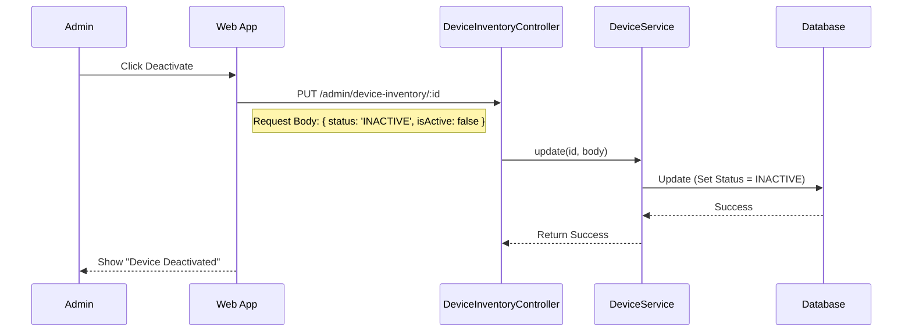
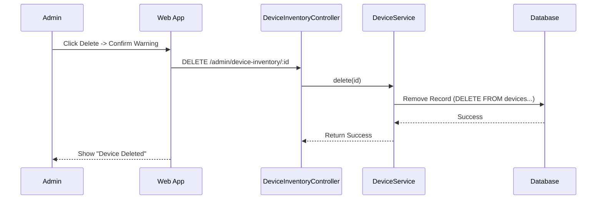

# Admin Device Management Documentation
---2.1.2.14---
## 1. Actors
- **Admin**: Manages the inventory of IoT devices (sensors, controllers) in the system.
- **Backend API (NestJS)**: `DeviceInventoryController`, `DeviceService`.
- **Database**: Stores `Device` records.

## 2. Use Case Specifications

### UC-DEV-01: Add New Device
| Feature | Description |
| :--- | :--- |
| **Use Case** | **Add New Device** |
| **Actor** | Admin |
| **Brief Description** | Admin registers a new physical device into the system inventory. |
| **Pre-conditions** | Admin is logged in. |
| **Basic Flows** | 1. Admin navigates to "Device Inventory". 2. Admin clicks "Add Device". 3. Admin enters **Serial Number**, **Name**, and **Type** (Sensor/Controller). 4. Admin submits form. 5. System validates uniqueness of Serial Number. 6. System creates device with status `AVAILABLE`. 7. System displays success message. |
| **Alternative Flows** | **A1. Duplicate Serial:** 1. System finds existing serial. 2. Error "Device already exists". |
| **Post-conditions** | New device created with status `AVAILABLE`. |

### UC-DEV-02: Search  Devices
| Feature | Description |
| :--- | :--- |
| **Use Case** | **Search Devices** |
| **Actor** | Admin |
| **Brief Description** | Admin searches for devices by Name/Serial or filters by Status. |
| **Pre-conditions** | Admin is logged in. |
| **Basic Flows** | 1. Admin enters keyword (Name/Serial) or selects Status (Active/Available/Inactive). 2. System filters the list based on criteria (Client-side or Server-side). 3. System displays matching devices. |
| **Post-conditions** | Filtered list displayed. |

### UC-DEV-03: Edit Device Information
| Feature | Description |
| :--- | :--- |
| **Use Case** | **Edit Device Information** |
| **Actor** | Admin |
| **Brief Description** | Admin updates device details (Name, Type). |
| **Pre-conditions** | Device exists. |
| **Basic Flows** | 1. Admin selects a device. 2. Admin clicks "Edit". 3. Admin updates fields (e.g., Name). 4. System saves changes. 5. System displays success. |
| **Post-conditions** | Device info updated. |

### UC-DEV-04: Deactivate Device (Soft Disable)
| Feature | Description |
| :--- | :--- |
| **Use Case** | **Deactivate Device** |
| **Actor** | Admin |
| **Brief Description** | Admin temporarily disables a device without removing it from the system. |
| **Pre-conditions** | Device exists and is currently `ACTIVE` or `AVAILABLE`. |
| **Basic Flows** | 1. Admin selects a device. 2. Admin clicks "Deactivate". 3. System updates Device Status to `INACTIVE` and `isActive = false`. 4. System cuts off MQTT communication (conceptually). 5. System displays success message. |
| **Post-conditions** | Device record remains in DB but status is `INACTIVE`. History is preserved. |

### UC-DEV-05: Delete Device (Hard Remove)
| Feature | Description |
| :--- | :--- |
| **Use Case** | **Delete Device** |
| **Actor** | Admin |
| **Brief Description** | Admin permanently removes a device from the system. |
| **Pre-conditions** | Device exists. **Warning: Irreversible action.** |
| **Basic Flows** | 1. Admin selects a device. 2. Admin clicks "Delete". 3. Admin confirms confirmation dialog ("Are you sure? This cannot be undone."). 4. System permanently removes the Device record from the Database. 5. System cascades delete to related Sensor Data (if configured). 6. System displays success message. |
| **Post-conditions** | Device record is deleted. Data may be lost. |

## 3. Sequence Diagrams

### 3.1 Sequence Diagram: Add Device

### 3.2 Sequence Diagram: Search & Filter Devices

### 3.3 Sequence Diagram: Edit Device

### 3.4 Sequence Diagram: Deactivate Device (Soft)

### 3.5 Sequence Diagram: Delete Device (Hard)

