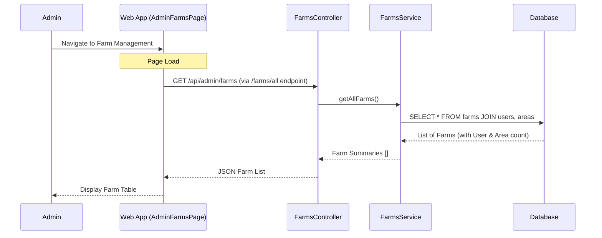
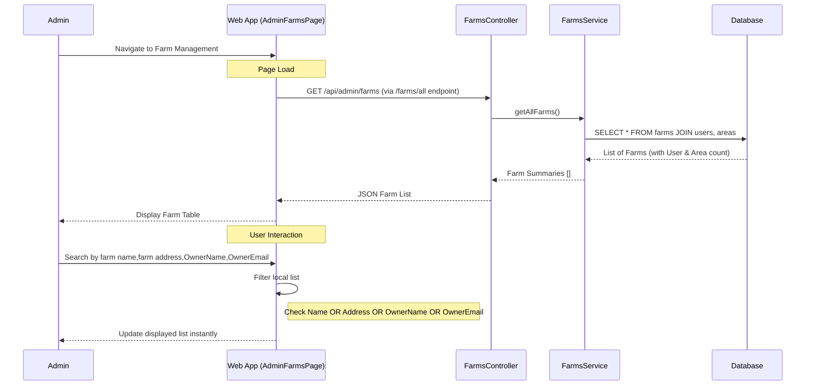
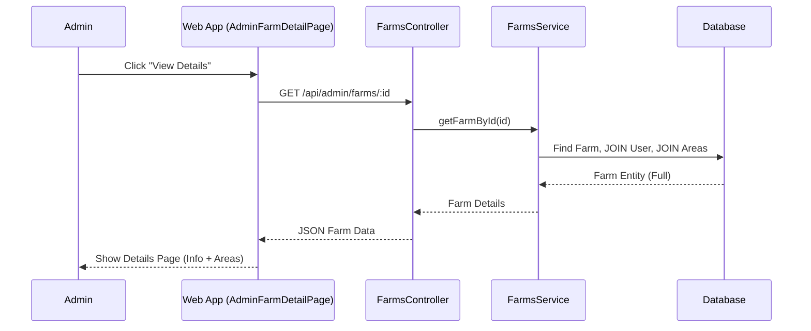

# Admin Farm Management Documentation
-----2.1.2.17-----

## 1. Overview
The Admin Farm Management module allows Administrators to oversee all farms in the system. Admins can view a comprehensive list of farms, search for specific farms using various criteria (farm name, address, owner information), and view detailed information for each farm including its cultivated areas.

## 2. Actors
- **Admin**: Has access to view all farm data.
- **Web App**: The frontend interface (Admin Panel).
- **System**: The backend API processing requests.

## 3. Use Case Specifications

### UC-ADM-FARM-01: View Farm List
| Feature | Description |
| :--- | :--- |
| **Use Case** | **View Farm List** |
| **Actor** | Admin |
| **Brief Description** | Admin views a paginated list of all farms in the system. |
| **Pre-conditions** | Admin is logged in. |
| **Basic Flows** | 1. Admin navigates to "Quản lý Nông trại" (Farm Management). 2. Web App sends request `GET /api/admin/farms`. 3. System retrieves all farms with owner info and area counts. 4. Web App displays the list of farms.   - Columns: ID, Farm Name, Owner (Name/Email), Address, Area Count, Created Date. |
| **Alternative Flows** | **A1. No Farms:** System returns empty list; UI shows "Chưa có nông trại nào". |
| **Post-conditions** | List of all farms is displayed. |

### UC-ADM-FARM-02: Search Farm
| Feature | Description |
| :--- | :--- |
| **Use Case** | **Search Farm** |
| **Actor** | Admin |
| **Brief Description** | Admin searches/filters the visible farm list by keywords (Client-side). |
| **Pre-conditions** | Admin is viewing the Farm List. |
| **Basic Flows** | 1. System has loaded all farms (from UC-ADM-FARM-01). 2. Admin enters a keyword in the Search Bar. 3. Web App filters the list instantly checking matches in:    - Farm Name    - Address    - Owner Name    - Owner Email 4. Web App updates the table to show matching results. |
| **Alternative Flows** | **A1. No Match:** UI shows "Không tìm thấy nông trại". |
| **Post-conditions** | Farm list filtered by the keyword. |

### UC-ADM-FARM-03: View Farm Details
| Feature | Description |
| :--- | :--- |
| **Use Case** | **View Farm Details** |
| **Actor** | Admin |
| **Brief Description** | Admin views comprehensive details of a specific farm. |
| **Pre-conditions** | Admin is viewing Farm List. |
| **Basic Flows** | 1. Admin clicks "Xem chi tiết" (View Details) button on a farm row. 2. Web App navigates to `/admin/farms/:id`. 3. Web App sends request `GET /api/admin/farms/:id`. 4. System retrieves full farm details + list of Areas. 5. Web App displays:    - Basic Info (ID, Name, Address, Desc).    - Owner Info (Name, Email).    - List of Cultivated Areas (Name, Type, Crop). |
| **Alternative Flows** | **A1. Farm Not Found:** System returns 404; UI redirects back to list or shows error. |
| **Post-conditions** | Detailed farm information is displayed. |

---

## 4. Sequence Diagrams

### 4.1 Sequence Diagram: View Farm List

### 4.2 Sequence Diagram: Search Farm (Client-side)

### 4.3 Sequence Diagram: View Farm Details

