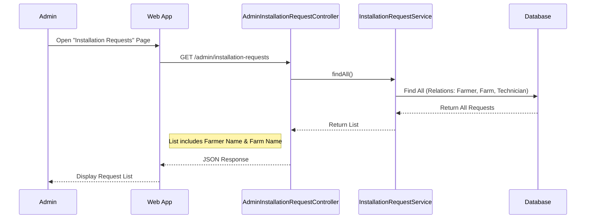
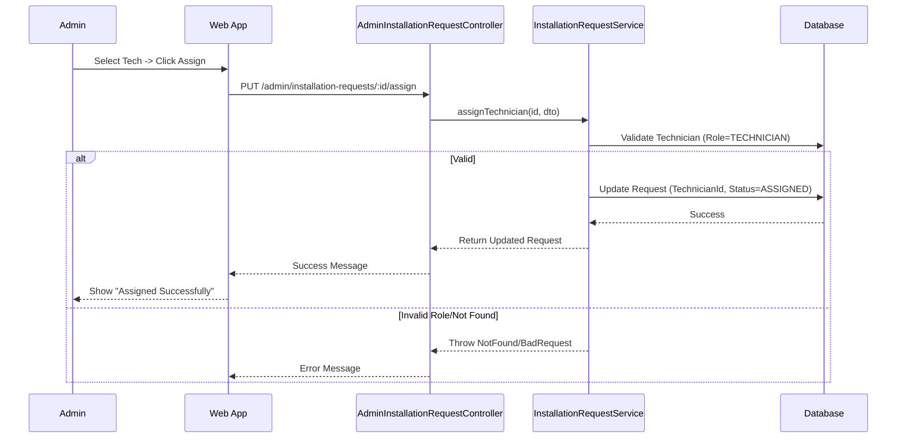
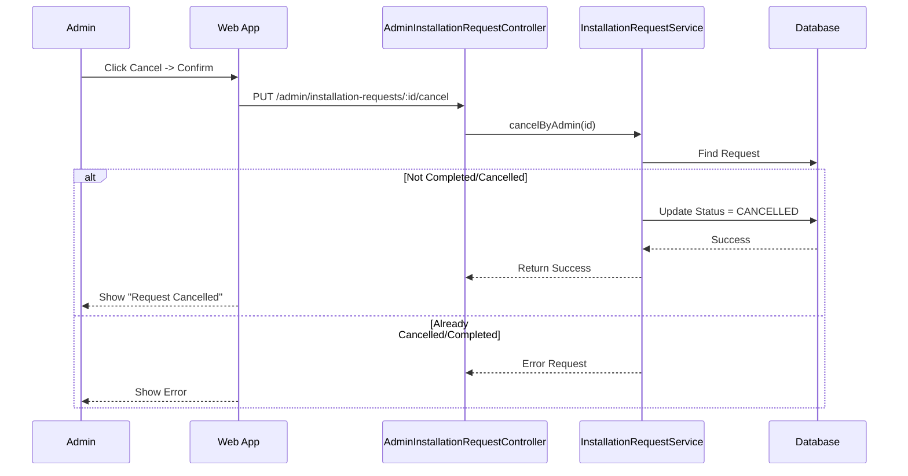
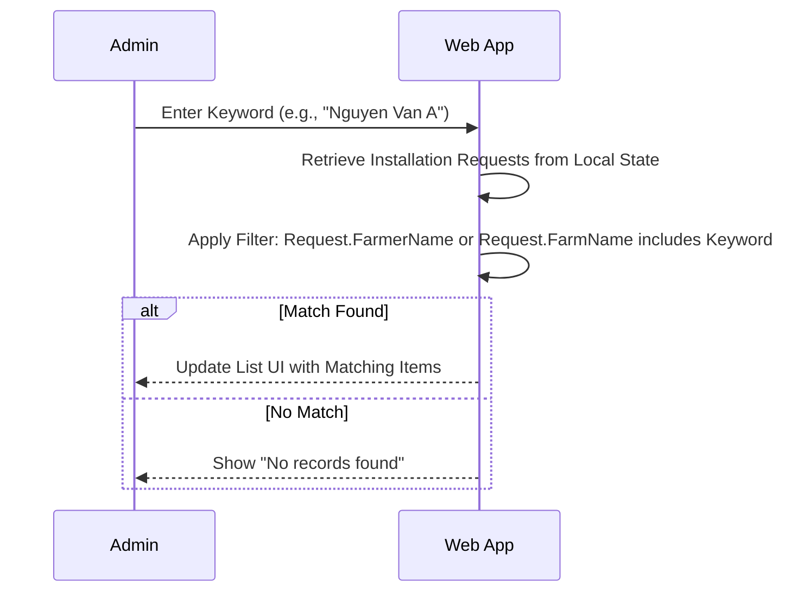

# Admin Installation Management Documentation
---2.1.2.13---
## 1. Actors
- **Admin**: Manages the overall installation process, assigns technicians, and oversees request statuses.
- **Backend API (NestJS)**: `AdminInstallationRequestController`.
- **Database**: Stores `InstallationRequest` and `User` (Technician) records.
## 2. Use Case Specifications
### UC-ADMIN-01: View Installation Requests
| Feature | Description |
| :--- | :--- |
| **Use Case** | **View Installation Requests** |
| **Actor** | Admin |
| **Brief Description** | Admin views a list of all installation requests in the system. |
| **Pre-conditions** | Admin is logged in. |
| **Basic Flows** | 1. Admin navigates to "Installation Requests". 2. System fetches all requests from the database. 3. System sorts requests (e.g., newest first). 4. System displays the list with summary details (Farmer, Status, Date). |
| **Post-conditions** | Admin sees the list of all requests. |
### UC-ADMIN-02: Assign Technician
| Feature | Description |
| :--- | :--- |
| **Use Case** | **Assign Technician** |
| **Actor** | Admin |
| **Brief Description** | Admin assigns a specific Technician to handle a pending installation request. |
| **Pre-conditions** | Request status is `PENDING` or `ASSIGNED`. Technician exists in system. |
| **Basic Flows** | 1. Admin selects a Request. 2. Admin clicks "Assign Technician". 3. System shows list of available Technicians. 4. Admin selects a Technician and confirms. 5. System updates request with `assignedTechnicianId` and sets status `ASSIGNED`. 6. System displays success message. |
| **Alternative Flows** | **A1. Technician Invalid:** 1. System checks ID implies not a technician. 2. Error "Invalid role". |
| **Post-conditions** | Request status becomes `ASSIGNED`. Technician is notified (conceptually). |
### UC-ADMIN-03: Cancel Request
| Feature | Description |
| :--- | :--- |
| **Use Case** | **Cancel Request** |
| **Actor** | Admin |
| **Brief Description** | Admin cancels a request due to invalid info or other reasons. |
| **Pre-conditions** | Request is NOT `COMPLETED` or `CANCELLED`. |
| **Basic Flows** | 1. Admin selects a Request. 2. Admin clicks "Cancel". 3. Admin confirms action. 4. System updates status to `CANCELLED`. 5. System displays success message. |
| **Post-conditions** | Request status becomes `CANCELLED`. |
### UC-ADMIN-04: Search Installation Requests
| Feature | Description |
| :--- | :--- |
| **Use Case** | **Search Installation Requests** |
| **Actor** | Admin |
| **Brief Description** | Admin filters the installation requests list by **Farmer Name** or **Farm Name**. |
| **Pre-conditions** | Admin is logged in. |
| **Basic Flows** | 1. Admin enters keywords (e.g., "Nguyen Van A", "Green Farm"). 2. System filters the displayed list based on the input. 3. System displays only the requests matching the Farmer Name or Farm Name. |
| **Alternative Flows** | **A1. No Matches:** 1. System finds no records matching criteria. 2. System displays "No requests found". |
| **Post-conditions** | Displayed list is filtered. |
## 3. Sequence Diagrams
### 3.1 Sequence Diagram: View Requests

### 3.2 Sequence Diagram: Assign Technician

### 3.3 Sequence Diagram: Cancel Request

### 3.4 Sequence Diagram: Search Requests (By Name/Farm)

