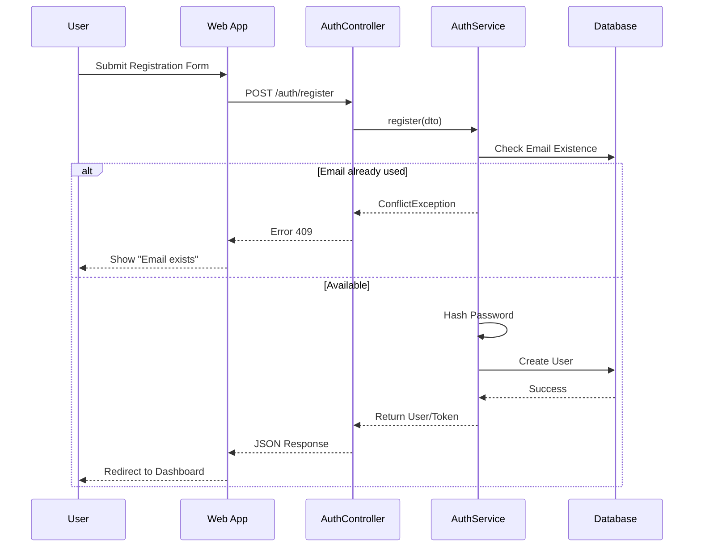
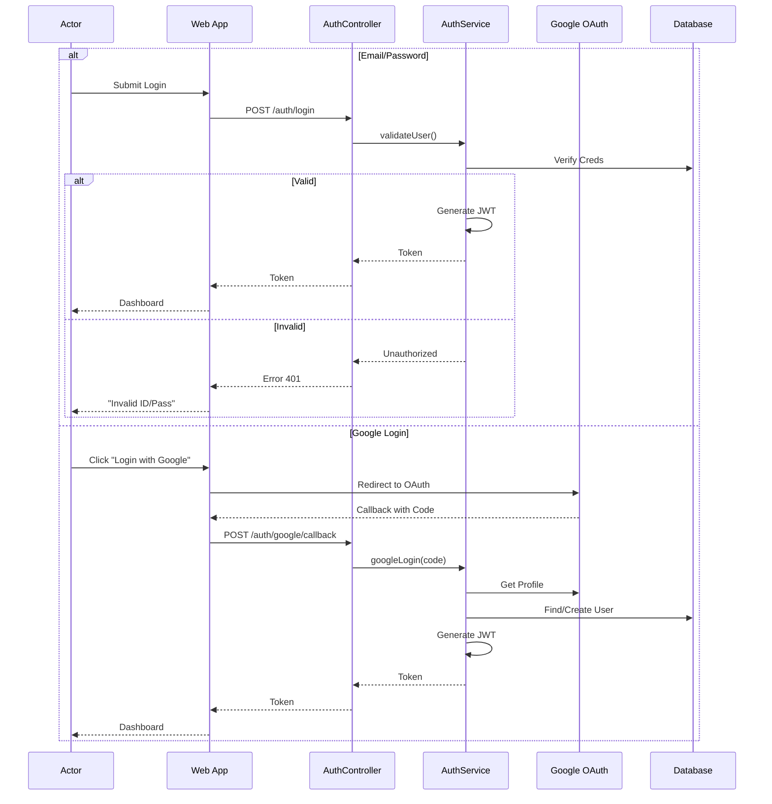
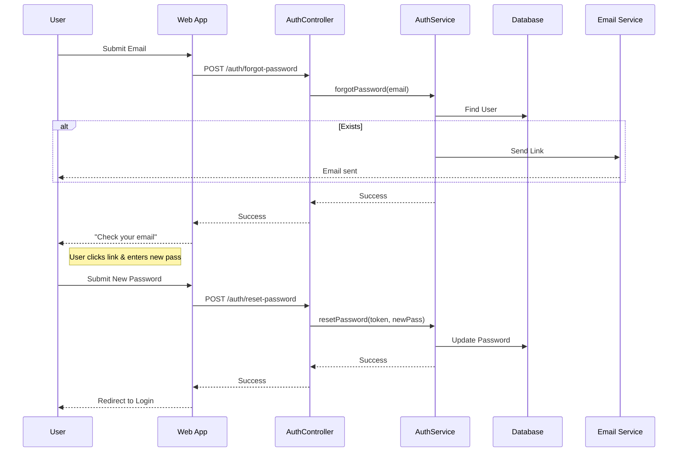
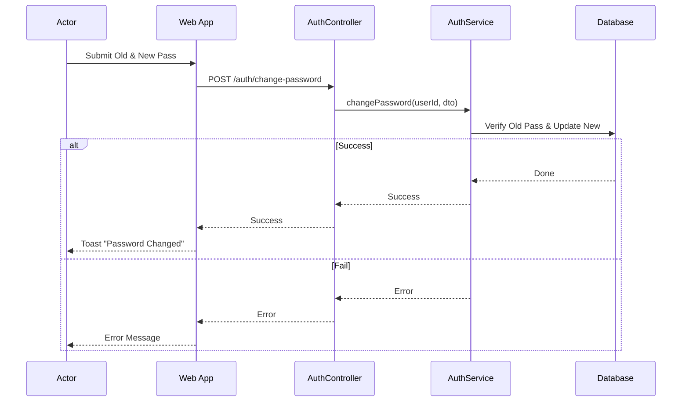
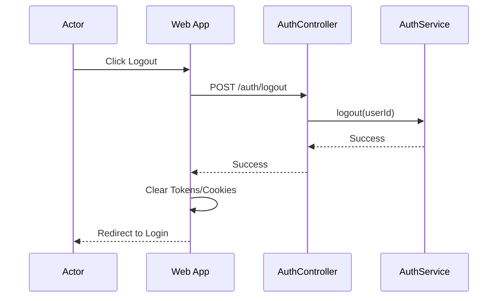

# Authentication Module Documentation
------2.1.2-----2.1.2.1----2.1.2.2-----
## 1. Actors
- **User (Farmer)**: Can Register, Login (Email/Google), Logout, Forgot Password, Change Password.
- **Technician**: Can Login (Email only), Logout, Change Password.
- **Admin**: Can Login (Email only), Logout, Change Password.

---

## 2. Use Case Specifications

### UC-AUTH-01: User Registration 
| Feature | Description |
| :--- | :--- |
| **Use Case** | **Register Account** |
| **Actor** | User |
| **Brief Description** | User creates a new account to use the system. |
| **Pre-conditions** | User is not logged in. |
| **Basic Flows** | 1. User enters Full Name, Email, Password, Phone. 2. User submits form. 3. System validates input (email format, uniqueness). 4. System creates account. 5. System logs user in or redirects to login. |
| **Alternative Flows** | **A1. Email Exists:** 1. System detects email is taken. 2. System shows error "Email already exists".  **A2. Validation Error:** 1. Password too-weak or invalid email. 2. System shows validation error. |
| **Post-conditions** | Account created in database. |

### UC-AUTH-02: System Login
| Feature | Description |
| :--- | :--- |
| **Use Case** | **Login** |
| **Actor** | User, Admin, Technician |
| **Brief Description** | Actors authenticate to access protected features. |
| **Pre-conditions** | Account exists. |
| **Basic Flows** | 1. Actor enters Email and Password. 2. System validates credentials. 3. System determines logic based on role (Admin/Tech/User). 4. System generates JWT Access Token. 5. System redirects to Dashboard (User/Farm or Admin Panel). |
| **Alternative Flows** | **A1. Invalid Credentials:** 1. Password mismatch. 2. System shows "Invalid email or password".  **A2. Login via Google (User Only):** 1. User clicks "Login with Google". 2. Redirects to Google OAuth. 3. Google returns profile. 4. System creates account (if new) or logs in. 5. Redirects to Dashboard. |
| **Post-conditions** | Actor is authenticated; Session active. |

### UC-AUTH-03: System Logout
| Feature | Description |
| :--- | :--- |
| **Use Case** | **Logout** |
| **Actor** | User, Admin, Technician |
| **Brief Description** | Terminate current session. |
| **Pre-conditions** | Actor is logged in. |
| **Basic Flows** | 1. Actor clicks "Logout". 2. System invalidates session/token (client-side removal). 3. System redirects to Login page. |
| **Post-conditions** | Actor is unauthenticated. |

### UC-AUTH-04: Forgot Password
| Feature | Description |
| :--- | :--- |
| **Use Case** | **Forgot Password** |
| **Actor** | User Only |
| **Brief Description** | Recover account access via email reset. |
| **Pre-conditions** | User is not logged in. |
| **Basic Flows** | 1. User enters Email. 2. System verifies email existence. 3. System generates reset token. 4. System sends email with Reset Link. 5. User clicks link -> Enters New Password. 6. System updates password. |
| **Alternative Flows** | **A1. Email Not Found:** 1. System shows generic success message (security) or error. |
| **Post-conditions** | Password updated. |

### UC-AUTH-05: Change Password
| Feature | Description |
| :--- | :--- |
| **Use Case** | **Change Password** |
| **Actor** | User, Technician, Admin |
| **Brief Description** | Authenticated user changes their password. |
| **Pre-conditions** | User/Technician/Admin is logged in. |
| **Basic Flows** | 1. User enters Old Password and New Password. 2. System validates Old Password. 3. System validates New Password rules. 4. System updates password hash. 5. System confirms success. |
| **Alternative Flows** | **A1. Wrong Old Password:** 1. System rejects change. |
| **Post-conditions** | Password key updated. |

---

## 3. Sequence Diagrams

### 3.1 Sequence Diagram: User Registration

### 3.2 Sequence Diagram: Login (Standard & Google)

### 3.3 Sequence Diagram: Forgot Password

### 3.4 Sequence Diagram: Change Password

### 3.5 Sequence Diagram: Logout

