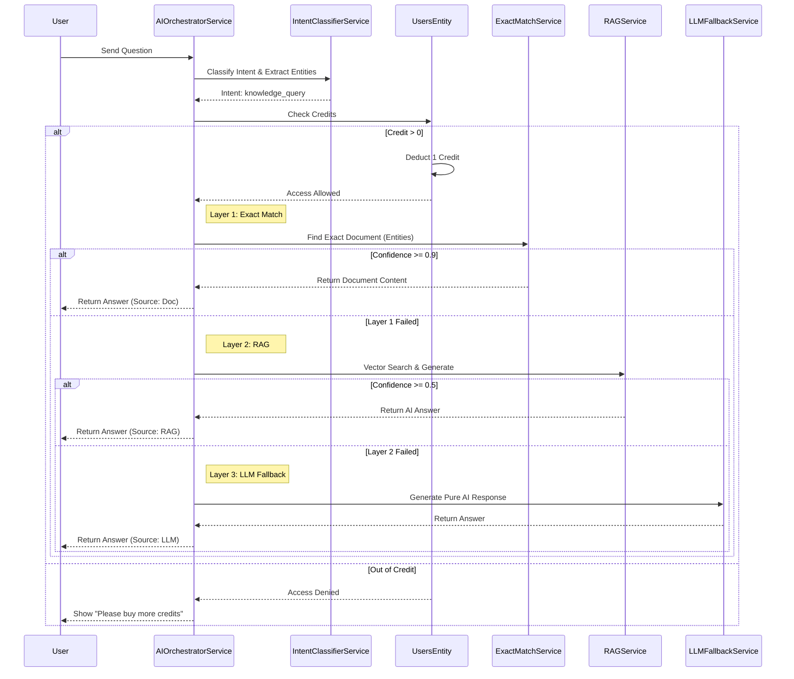
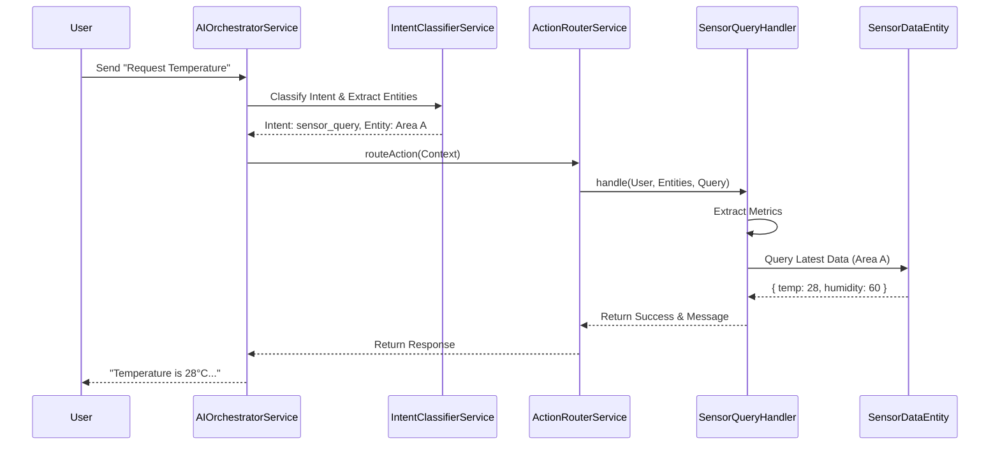
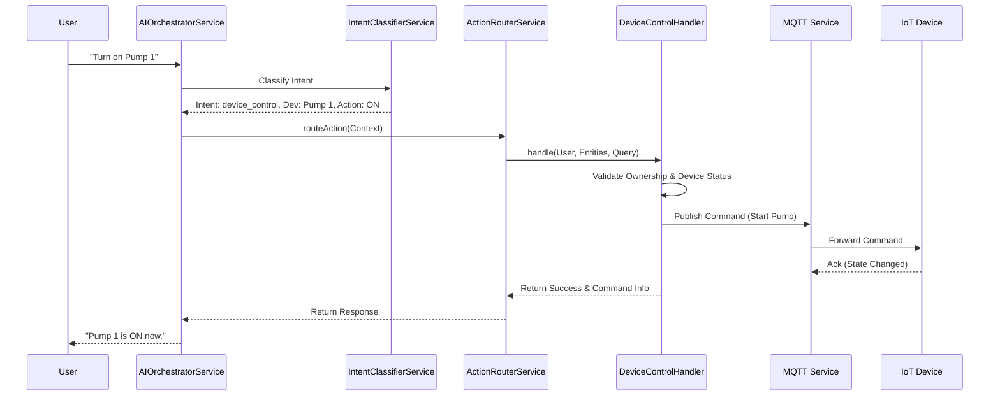
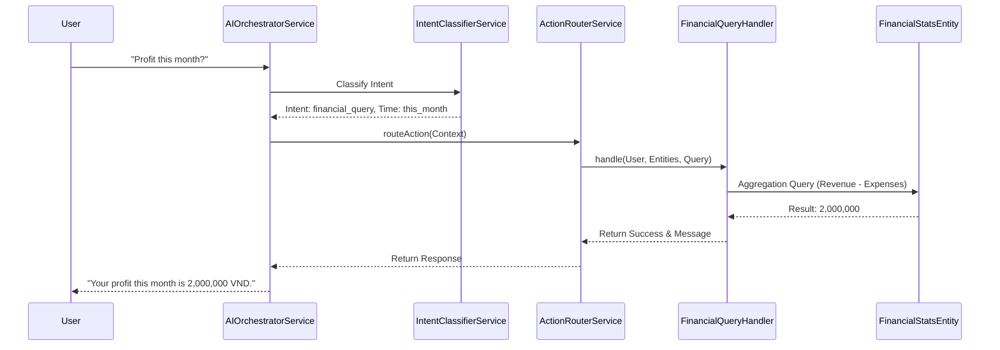

# Chatbot Interaction Documentation
----2.1.2.8----
## 1. Actors
- **User (Farmer)**: Interacts with the chatbot via natural language.
- **Chatbot (AI System)**: Processes requests (NLP), queries databases/IoT, and responds.
- **IoT System**: Sensors and Devices (Pumps, Lights).
- **Python AI Service**: Handles Intent Recognition and NER.
- **Gemini (LLM)**: Generates natural language responses for QA.

## 2. Use Case Specifications

### UC-CHAT-01: IoT Interaction via ChatBot (Sensor Query & Device Control)
| Feature | Description |
| :--- | :--- |
| **Use Case** | **IoT Interaction** |
| **Actor** | User |
| **Brief Description** | User asks for sensor data or commands devices to turn on/off via chat. |
| **Pre-conditions** | User is logged in. Farm has configured IoT devices. |
| **Basic Flows** | **Flow A: Query Sensors** 1. User asks: "How is the temperature in Greenhouse 1?" 2. Chatbot identifies intent `sensor_query` and entity `area`. 3. System fetches latest sensor data for that area. 4. Chatbot replies: "Current temperature in Greenhouse 1 is 28°C."  **Flow B: Control Device** 1. User says: "Turn on the pump for 10 minutes." 2. Chatbot identifies intent `device_control`, device `pump`, action `ON`, duration `10m`. 3. System commands device via MQTT. 4. Chatbot replies: "Pump turned on for 10 minutes." |
| **Alternative Flows** | **A1. Ambiguous Request:** 1. System cannot identify specific device/area. 2. Chatbot asks for clarification.  **A2. Device Offline:** 1. Command fails. 2. Chatbot reports error. |
| **Post-conditions** | User receives info or device state changes. |

### UC-CHAT-02: Ask Agriculture Knowledge (QA)
| Feature | Description |
| :--- | :--- |
| **Use Case** | **Ask Agriculture Knowledge** |
| **Actor** | User |
| **Brief Description** | User asks general farming questions. The system processes this through a 3-layer architecture: Exact Match -> RAG -> LLM Fallback. |
| **Pre-conditions** | User is logged in. **User has credits > 0** (or active Premium with unlimited/daily quota). |
| **Basic Flows** | 1. User asks a question (e.g., "Mật độ trồng cà chua?"). 2. **Intent Analysis**: System determines intent is `knowledge_query`. 3. **Credit Check**: System checks if User Credit > 0. If yes, deduct 1 credit. 4. **Layer 1 (Exact Match)**: System searches for exact document match (Confidence >= 0.9). If found, return content. 5. **Layer 2 (RAG)**: If Layer 1 fails, System searches Vector DB (Similarity >= 0.7). If context found, generate answer via Gemini. 6. **Layer 3 (LLM Fallback)**: If Layer 2 fails, System uses pure LLM knowledge to answer. 7. Chatbot displays the answer to User along with the source (Document/AI). |
| **Alternative Flows** | **A1. Out of Credits:** 1. System checks credit = 0. 2. System denies request. 3. Chatbot replies: "You have run out of credits. Please upgrade or buy more."  **A2. Off-topic (Unknown Intent):** 1. Query classified as UNKNOWN. 2. System validates if agriculture-related. 3. If valid -> Layer 3 (LLM Fallback). 4. If off-topic -> Reject ("I only answer agriculture questions"). |
| **Post-conditions** | User receives answer; 1 Credit deducted. |

### UC-CHAT-03: Query Farm Financial Data
| Feature | Description |
| :--- | :--- |
| **Use Case** | **Query Farm Financial Data** |
| **Actor** | User |
| **Brief Description** | User asks for financial summaries via chat. |
| **Pre-conditions** | User has a farm with financial records. |
| **Basic Flows** | 1. User asks: "What is my revenue this month?" 2. Chatbot identifies intent `yield_farming_query` (or similar financial intent). 3. System queries database for aggregated financial stats. 4. Chatbot replies: "Your revenue for December is 5,000,000 VND." |
| **Post-conditions** | User receives financial insight. |

## 3. Sequence Diagrams

### 3.1 Sequence Diagram: Ask Agriculture Knowledge (3-Layer Architecture)

### 3.2 Sequence Diagram: IoT Sensor Query

### 3.3 Sequence Diagram: IoT Device Control

### 3.4 Sequence Diagram: Query Financial Data

