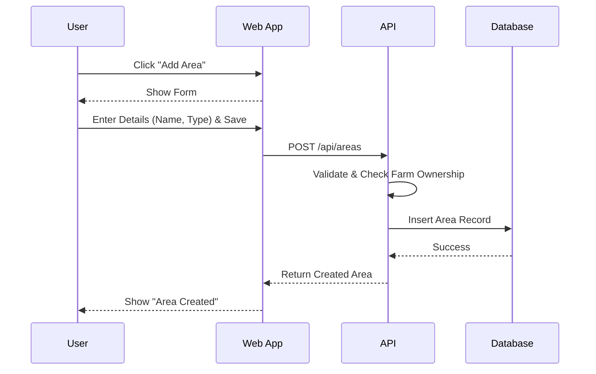
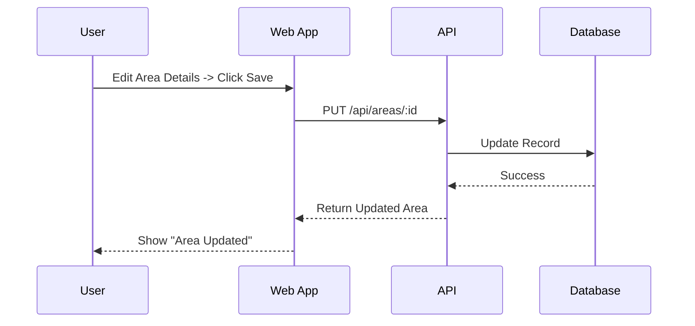
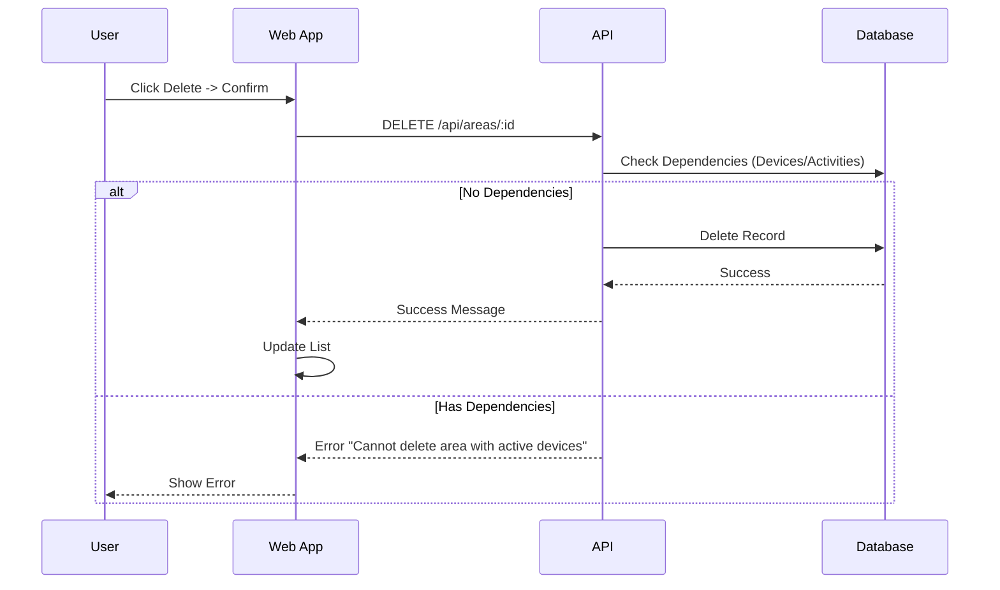

# Cultivation Area Management Documentation
-----2.1.2.6-------
## 1. Actors
- **User (Farmer)**: Manage cultivation areas within their farm.

## 2. Use Case Specifications

### UC-AREA-01: Add Cultivation Area
| Feature | Description |
| :--- | :--- |
| **Use Case** | **Add Cultivation Area** |
| **Actor** | User |
| **Brief Description** | User defines a new area (e.g., "Greenhouse 1") for farming. |
| **Pre-conditions** | User is logged in and owns a farm. |
| **Basic Flows** | 1. User navigates to Farm Detail/Areas page. 2. User clicks "Add Area". 3. User enters Area Name, Type (e.g., Outdoor, Greenhouse), and Size. 4. User clicks "Create". 5. System validates data. 6. System saves new area. 7. System reflects new area in list. |
| **Alternative Flows** | **A1. Validation Error:** 1. Missing name. 2. System shows error. |
| **Post-conditions** | New area added to farm. |

### UC-AREA-02: Edit Cultivation Area
| Feature | Description |
| :--- | :--- |
| **Use Case** | **Edit Cultivation Area** |
| **Actor** | User |
| **Brief Description** | User updates details of a specific area. |
| **Pre-conditions** | User owns the area. |
| **Basic Flows** | 1. User selects an Area. 2. User clicks "Edit". 3. User updates fields (Name, Description). 4. User clicks "Save". 5. System validates and updates record. 6. System displays success message. |
| **Post-conditions** | Area details updated. |

### UC-AREA-03: Delete Cultivation Area
| Feature | Description |
| :--- | :--- |
| **Use Case** | **Delete Cultivation Area** |
| **Actor** | User |
| **Brief Description** | User removes an area. |
| **Pre-conditions** | User owns the area. Warning: Deleting area might affect associated activities/devices. |
| **Basic Flows** | 1. User selects an Area. 2. User clicks "Delete". 3. System warns about cascading effects (if any). 4. User confirms. 5. System deletes area. 6. System removes area from UI. |
| **Alternative Flows** | **A1. Restriction:** 1. Area has active devices/installations. 2. System prevents delete and asks user to remove devices first. |
| **Post-conditions** | Area removed. |

## 3. Sequence Diagrams

### 3.1 Sequence Diagram: Add Cultivation Area

### 3.2 Sequence Diagram: Edit Cultivation Area

### 3.3 Sequence Diagram: Delete Cultivation Area

