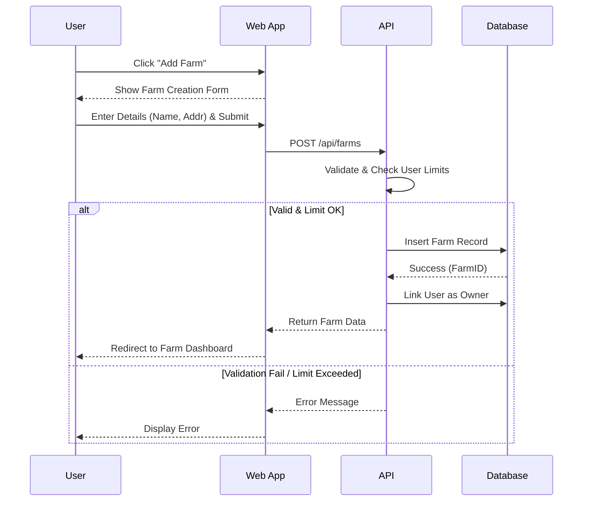
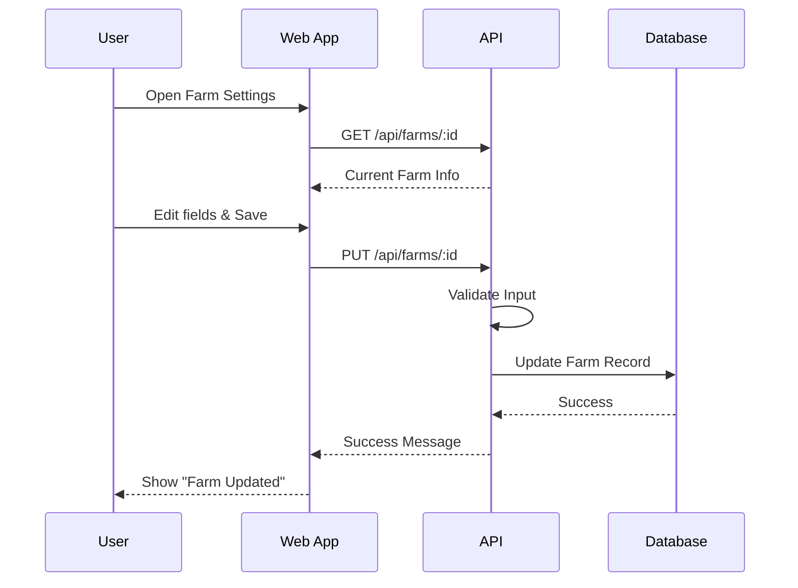
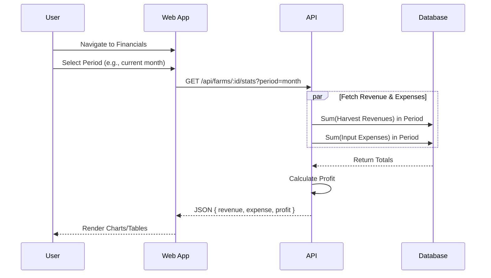

# Farm Management Documentation
------2.1.2.4-----
## 1. Actors
- **User (Farmer)**: Managing their own farm and financial data.

## 2. Use Case Specifications

### UC-FARM-01: Add Farm
| Feature | Description |
| :--- | :--- |
| **Use Case** | **Add Farm** |
| **Actor** | User |
| **Brief Description** | User registers a new farm in the system. Note: Each user typically owns one farm, but the system may allow adding one if none exists. |
| **Pre-conditions** | User is logged in. User does not have a farm (if 1-farm limit applies) or limit not reached. |
| **Basic Flows** | 1. User navigates to "My Farms" or Dashboard. 2. User clicks "Add Farm". 3. User enters Farm Name, Address, Description. 4. User clicks "Create". 5. System validates input. 6. System creates farm record. 7. System associates farm with User. 8. System redirects to Farm Dashboard. |
| **Alternative Flows** | **A1. Validation Error:** 1. Missing required fields. 2. System shows error.  **A2. Limit Reached:** 1. User tries to add a second farm (if rule exists). 2. System shows "You can only own one farm". |
| **Post-conditions** | New farm created; User is set as owner. |

### UC-FARM-02: Edit Farm
| Feature | Description |
| :--- | :--- |
| **Use Case** | **Edit Farm** |
| **Actor** | User |
| **Brief Description** | User updates farm details. |
| **Pre-conditions** | User is logged in and owns the farm. |
| **Basic Flows** | 1. User navigates to Farm Settings. 2. User updates Name, Address, or Description. 3. User clicks "Save". 4. System validates input. 5. System updates record. 6. System shows success message. |
| **Alternative Flows** | **A1. Validation Error:** 1. Invalid data. 2. System shows error. |
| **Post-conditions** | Farm details updated. |

### UC-FARM-03: View Financial Data
| Feature | Description |
| :--- | :--- |
| **Use Case** | **View Financial Data** |
| **Actor** | User |
| **Brief Description** | User views revenue, expenses, and profit statistics. |
| **Pre-conditions** | User is logged in and has a farm with activity logs. |
| **Basic Flows** | 1. User navigates to "Financials" or "Statistics" tab. 2. System fetches financial data (Expenses from inputs, Revenue from harvests). 3. System calculates Profit = Revenue - Expenses. 4. System displays dashboard (Charts/Tables) filtered by month/year. 5. User changes time filter (e.g., "This Month"). 6. System updates view. |
| **Alternative Flows** | **A1. No Data:** 1. No activities recorded yet. 2. System shows empty state or "No data available". |
| **Post-conditions** | Financial insights displayed. |

## 3. Sequence Diagrams

### 3.1 Sequence Diagram: Add Farm

### 3.2 Sequence Diagram: Edit Farm

### 3.3 Sequence Diagram: View Financial Data

