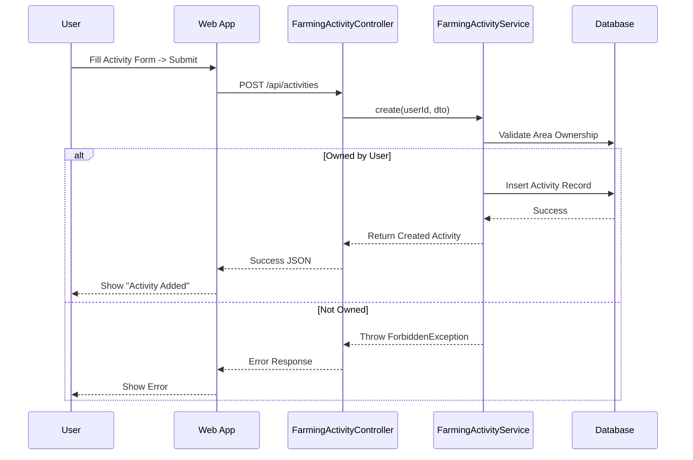
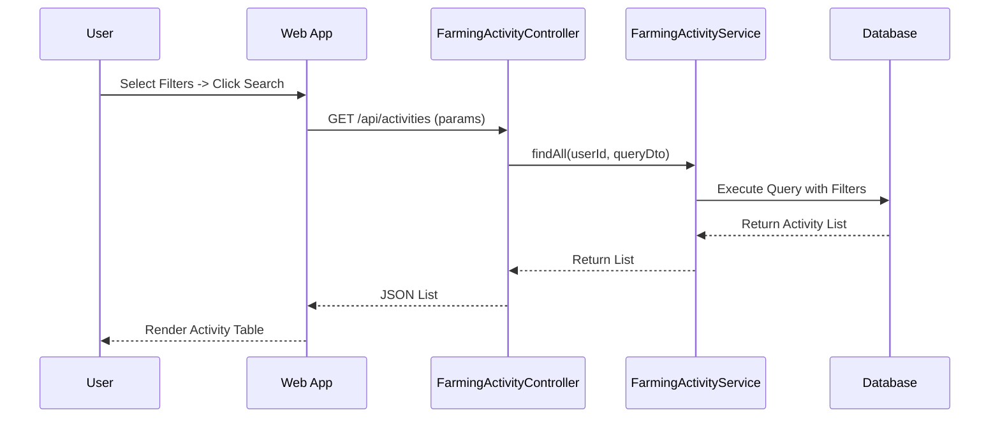
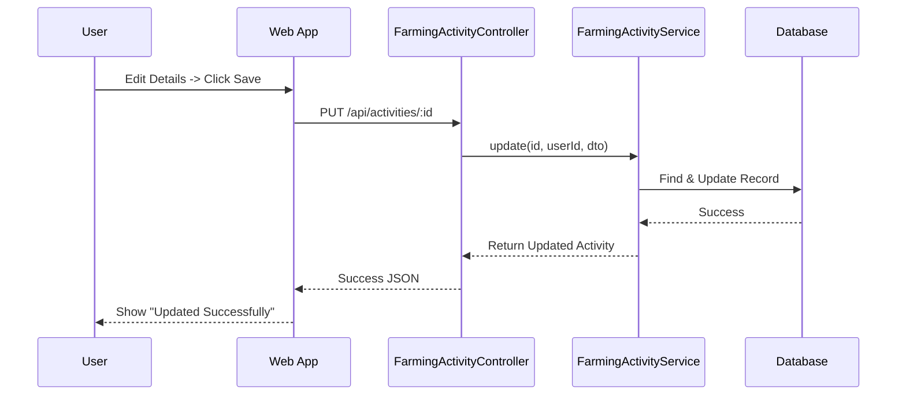
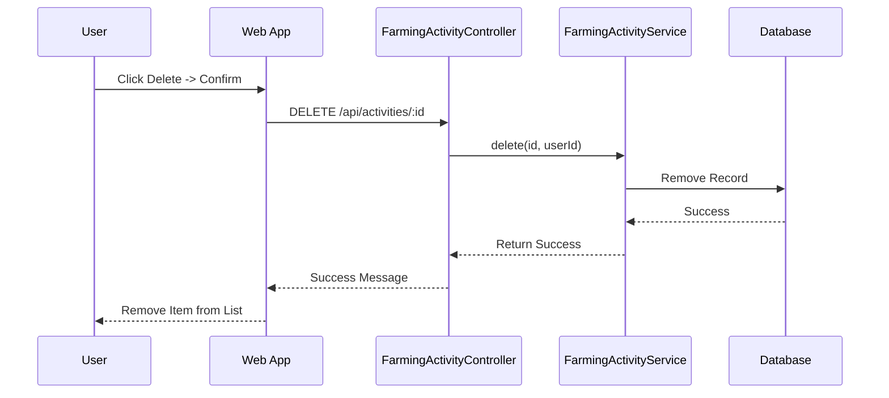

# Farming Activity Management Documentation
-----2.1.2.5-----
## 1. Actors
- **User (Farmer)**: Record and manage daily farming activities.

## 2. Use Case Specifications

### UC-ACT-01: Add Farming Activity
| Feature | Description |
| :--- | :--- |
| **Use Case** | **Add Farming Activity** |
| **Actor** | User |
| **Brief Description** | User records a new activity (e.g., Planting, Fertilizing, Harvesting) for a specific area. |
| **Pre-conditions** | User is logged in and has at least one cultivation area. |
| **Basic Flows** | 1. User navigates to "Activities" or specific "Area". 2. User clicks "Add Activity". 3. User selects **Area** and **Plant** (optional). 4. User selects **Type** (e.g., Fertilize, Water, Harvest). 5. User enters **Date**, **Description**, and specialized data (e.g., amount of fertilizer). 6. User clicks "Save". 7. System validates input. 8. System creates activity record. 9. System displays "Activity added successfully". |
| **Alternative Flows** | **A1. Validation Fail:** 1. Missing date or type. 2. System shows error. |
| **Post-conditions** | Activity is saved in history. |

### UC-ACT-02: Edit Farming Activity
| Feature | Description |
| :--- | :--- |
| **Use Case** | **Edit Farming Activity** |
| **Actor** | User |
| **Brief Description** | User modifies an existing activity record. |
| **Pre-conditions** | User owns the activity record. |
| **Basic Flows** | 1. User selects an activity from the list. 2. User clicks "Edit". 3. User updates fields (e.g., change date or description). 4. User clicks "Update". 5. System validates and saves changes. 6. System displays success message. |
| **Post-conditions** | Activity record is updated. |

### UC-ACT-03: Delete Farming Activity
| Feature | Description |
| :--- | :--- |
| **Use Case** | **Delete Farming Activity** |
| **Actor** | User |
| **Brief Description** | User removes an activity record. |
| **Pre-conditions** | User owns the activity record. |
| **Basic Flows** | 1. User selects an activity. 2. User clicks "Delete". 3. System asks for confirmation "Are you sure?". 4. User confirms. 5. System deletes record. 6. System removes item from list. |
| **Post-conditions** | Activity record is permanently removed. |

### UC-ACT-04: Search Farming Activities
| Feature | Description |
| :--- | :--- |
| **Use Case** | **Search Activities** |
| **Actor** | User |
| **Brief Description** | User finds activities based on specific criteria. |
| **Pre-conditions** | User has activity records. |
| **Basic Flows** | 1. User navigates to Activity History. 2. User enters filter criteria:    - **Area**: Select from list.    - **Plant**: Select plant type.    - **Activity Type**: Select (Sowing, Harvest, etc.).    - **Time Range**: Start Date - End Date.    - **Description**: Text keyword. 3. User clicks "Search". 4. System queries database with filters. 5. System returns matching list. 6. User views results. |
| **Alternative Flows** | **A1. No Results:** 1. No records match criteria. 2. System shows "No activities found". |
| **Post-conditions** | Filtered list is displayed. |

## 3. Sequence Diagrams

### 3.1 Sequence Diagram: Add Activity

### 3.2 Sequence Diagram: Search Activities

### 3.3 Sequence Diagram: Edit Activity

### 3.4 Sequence Diagram: Delete Activity

