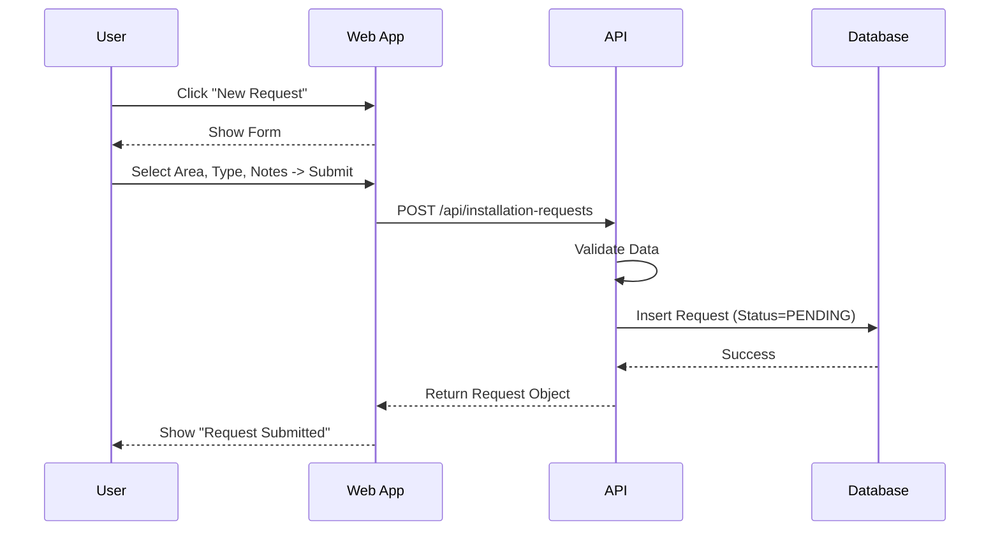
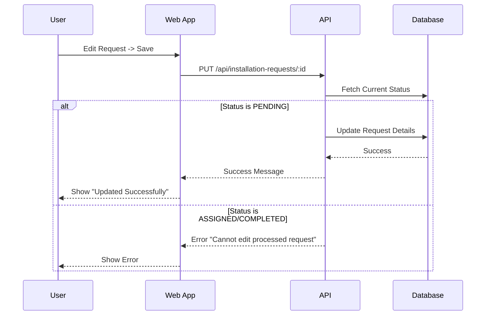
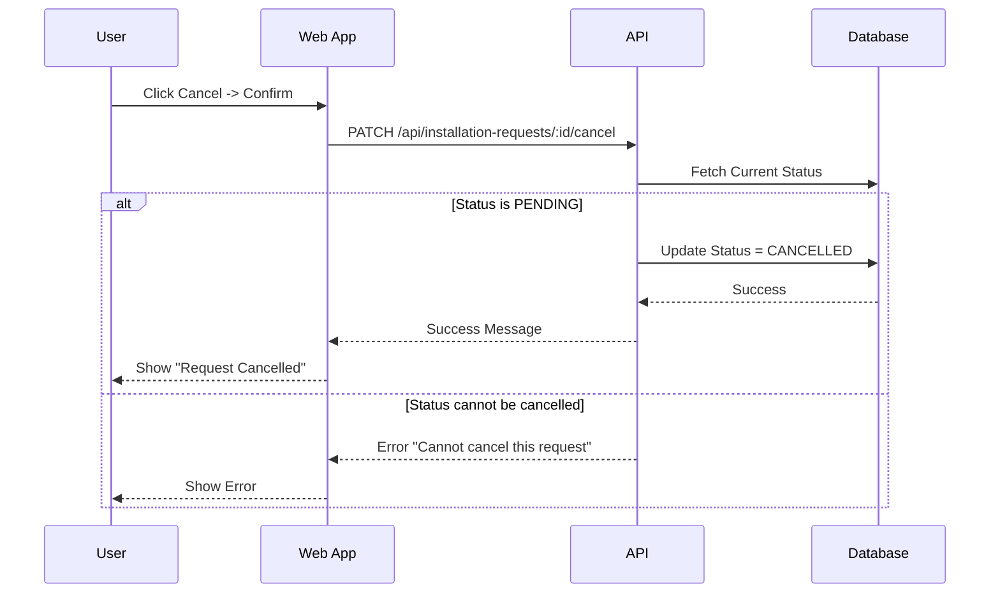

# Installation Request Management Documentation
-----2.1.2.7-----
## 1. Actors
- **User (Farmer)**: Requests IoT installation services for their farm.

## 2. Use Case Specifications

### UC-REQ-01: Create Installation Request
| Feature | Description |
| :--- | :--- |
| **Use Case** | **Create Installation Request** |
| **Actor** | User |
| **Brief Description** | User submits a request to install IoT devices in a specific area. |
| **Pre-conditions** | User is logged in and has a farm/area. |
| **Basic Flows** | 1. User navigates to "Installation Requests". 2. User clicks "New Request". 3. User selects **Target Area**. 4. User enters **Device Type** needed (e.g., Pump, Sensor) and **Notes**. 5. User clicks "Submit". 6. System creates request with status "PENDING". 7. System notifies Admin. 8. System displays confirmation. |
| **Alternative Flows** | **A1. Validation Error:** 1. Missing area or description. 2. System shows error. |
| **Post-conditions** | Request exists in "PENDING" state. |

### UC-REQ-02: Edit Installation Request
| Feature | Description |
| :--- | :--- |
| **Use Case** | **Edit Installation Request** |
| **Actor** | User |
| **Brief Description** | User updates details of a pending request. |
| **Pre-conditions** | Request is in "PENDING" status. (Cannot edit if "ASSIGNED" or "COMPLETED"). |
| **Basic Flows** | 1. User selects a Pending Request. 2. User clicks "Edit". 3. User modifies details (e.g., change notes or area). 4. User clicks "Update". 5. System validates status is still PENDING. 6. System saves changes. 7. System shows success. |
| **Alternative Flows** | **A1. Status Changed:** 1. Admin assigned technician while user was editing. 2. System prevents update: "Cannot edit processed request". |
| **Post-conditions** | Request details updated. |

### UC-REQ-03: Cancel Installation Request
| Feature | Description |
| :--- | :--- |
| **Use Case** | **Cancel Installation Request** |
| **Actor** | User |
| **Brief Description** | User withdraws a request before it is processed. |
| **Pre-conditions** | Request is in "PENDING" status. |
| **Basic Flows** | 1. User selects a Pending Request. 2. User clicks "Cancel". 3. User confirms action. 4. System updates status to "CANCELLED". 5. System displays success message. |
| **Alternative Flows** | **A1. Already Processed:** 1. Request is already ASSIGNED. 2. System shows error "Cannot cancel progressed request". |
| **Post-conditions** | Request status becomes "CANCELLED". |

## 3. Sequence Diagrams

### 3.1 Sequence Diagram: Create Installation Request

### 3.2 Sequence Diagram: Edit Installation Request

### 3.3 Sequence Diagram: Cancel Installation Request

