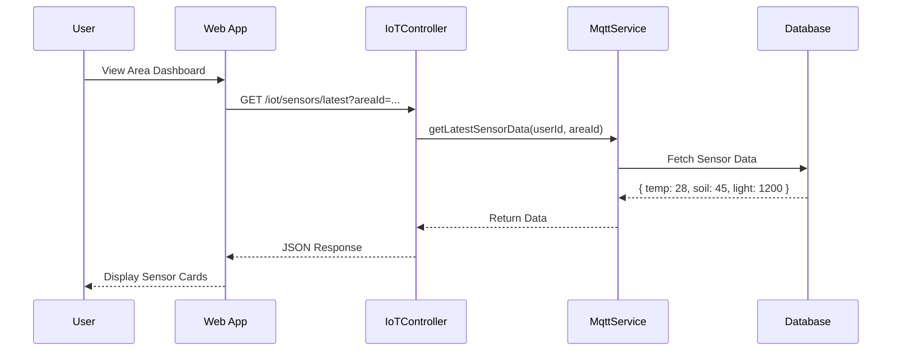
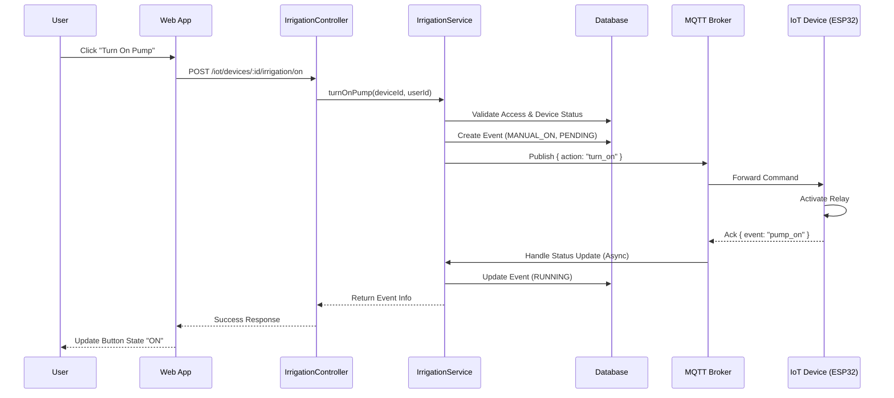
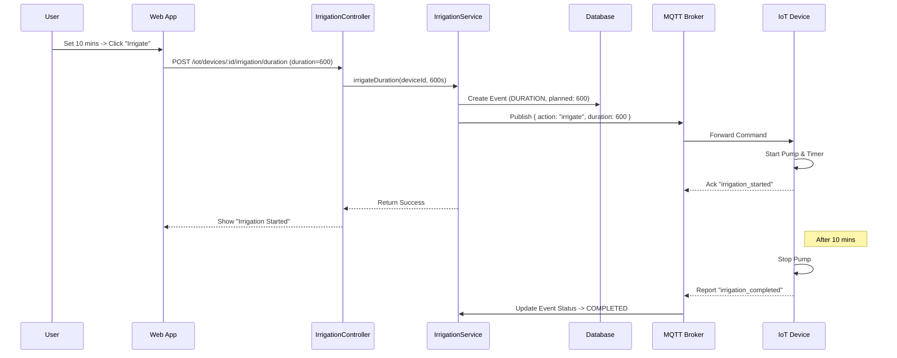
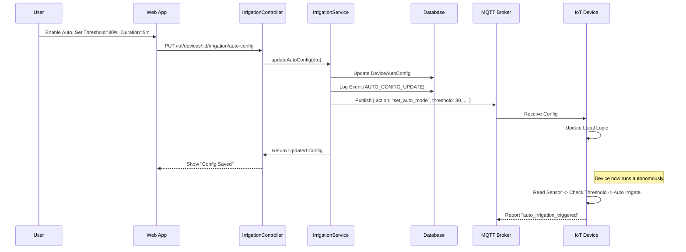

# IoT Dashboard Interation Documentation
----2.1.2.9-----
## 1. Actors
- **User (Farmer)**: Monitors and controls farm devices via the Dashboard.
- **Frontend (Web App)**: React components (`LightingControlPanel`, `IrrigationHistory`, etc.)
- **Backend API (NestJS)**: `IoTController`, `IrrigationController`, `LightingController`.
- **IoT Service**: Handles business logic and MQTT publishing.
- **MQTT Broker**: Relays commands to physical devices.
- **IoT Device (ESP32)**: Executors (Pumps, Lights) and Sensors.

## 2. Use Case Specifications

### UC-IOT-01: Get Area Sensor Data
| Feature | Description |
| :--- | :--- |
| **Use Case** | **Get Area Sensor Data** |
| **Actor** | User |
| **Brief Description** | User views real-time sensor data (Temperature, Humidity, Soil Moisture) for a specific farm area. |
| **Pre-conditions** | User is logged in. Area has active sensor nodes. |
| **Basic Flows** | 1. User selects an Area on the Dashboard. 2. System requests latest sensor data for that area. 3. System retrieves data from Redis/Database (cached from MQTT). 4. System displays current metrics (e.g., Temp: 28°C, Humidity: 65%). |
| **Alternative Flows** | **A1. No Data:** 1. System returns empty or outdated status. 2. Dashboard shows "Offline" or "No Data". |
| **Fail Conditions** | API failure or MQTT Broker down. |

### UC-IOT-02: Manual Device Control (On/Off)
| Feature | Description |
| :--- | :--- |
| **Use Case** | **Manual Device Control** |
| **Actor** | User |
| **Brief Description** | User manually turns a Pump or Light ON/OFF. |
| **Pre-conditions** | device is Online and in "Manual" mode (Auto mode might override if not handled). |
| **Basic Flows** | 1. User clicks "Turn On" on a device card. 2. System validates ownership. 3. System publishes `turn_on` command to MQTT topic. 4. Device receives command and activates. 5. Device sends ACK status update. 6. System logs `MANUAL_ON` event. 7. Dashboard updates status to "ON". |
| **Alternative Flows** | **A1. Device Error:** 1. Device does not ACK within timeout. 2. System shows "Command Timed Out". |

### UC-IOT-03: Control Device with Duration
| Feature | Description |
| :--- | :--- |
| **Use Case** | **Control Device with Duration** |
| **Actor** | User |
| **Brief Description** | User turns on a device for a specific time (e.g., Water for 10 mins). |
| **Pre-conditions** | Device is Online. |
| **Basic Flows** | 1. User clicks "Irrigate with Duration". 2. User selects duration (e.g., 10 minutes). 3. User confirms. 4. System creates `DURATION` event (Status: Pending). 5. System publishes `irrigate` command with `duration: 600` to MQTT. 6. Device starts and counts down. 7. Device turns off automatically after duration. 8. System logs completion. |
| **Post-conditions** | Device turns off after X minutes. |

### UC-IOT-04: Configure Auto Control (Threshold/Schedule)
| Feature | Description |
| :--- | :--- |
| **Use Case** | **Configure Auto Control** |
| **Actor** | User |
| **Brief Description** | User sets up automatic rules (e.g., Water if Soil Moisture < 30%). |
| **Pre-conditions** | User has Premium subscription (implied by `PremiumSubscriptionGuard`). |
| **Basic Flows** | 1. User navigates to Device Settings -> Auto Configuration. 2. User enables "Auto Mode". 3. User sets **Moisture Threshold** (e.g., 30%) and **Duration** (e.g., 5 mins). 4. User saves configuration. 5. System updates `DeviceAutoConfig` in DB. 6. System publishes `set_auto_mode` config to Device via MQTT. 7. Device now operates autonomously based on local sensor readings. |
| **Post-conditions** | Device operates automatically without server intervention. |

## 3. Sequence Diagrams

### 3.1 Sequence Diagram: Get Area Sensor Data

### 3.2 Sequence Diagram: Manual Device Control (Turn On/Off)

### 3.3 Sequence Diagram: Control with Duration

### 3.4 Sequence Diagram: Configure Auto Mode

