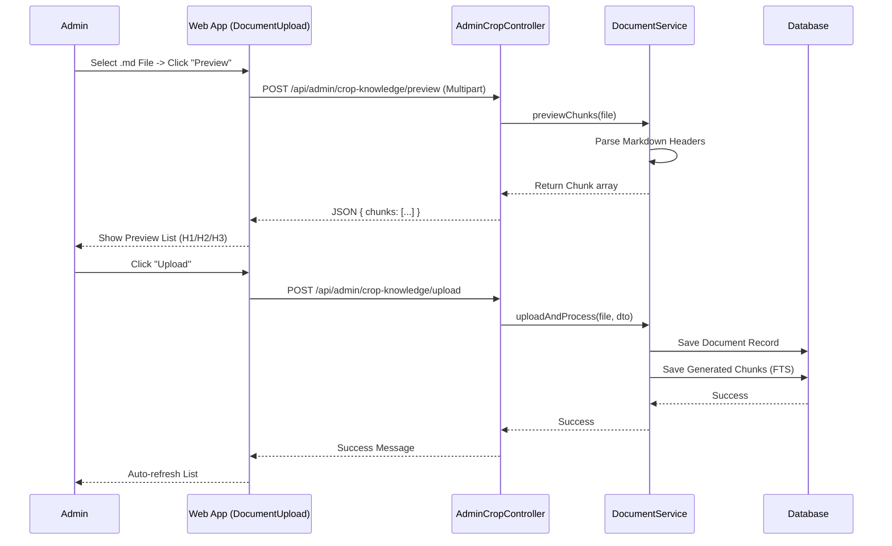
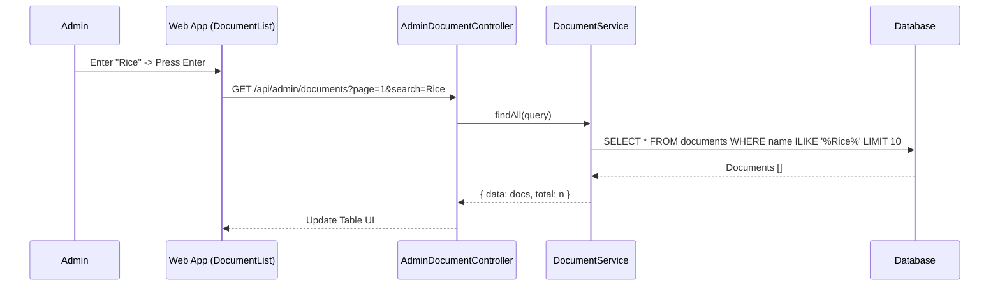
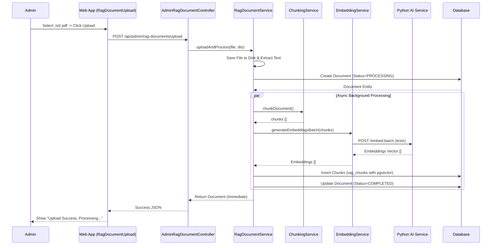
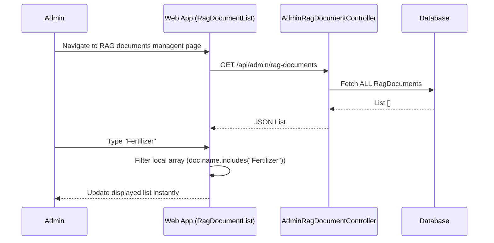
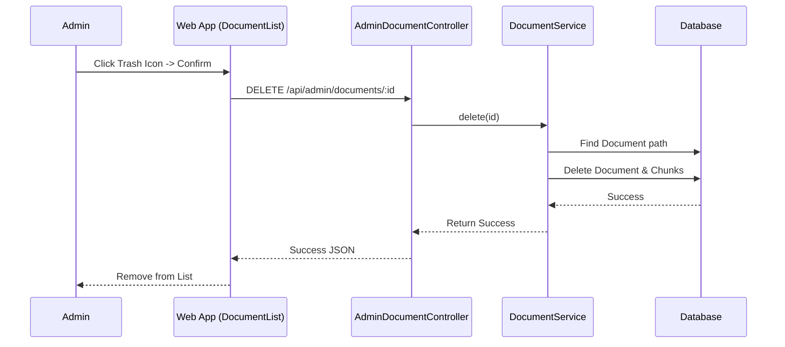
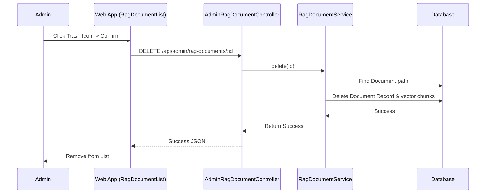

# Knowledge Management Documentation
-----2.1.2.15-----
## 1. Overview
The Knowledge Management module is divided into two distinct layers to support the Chatbot's AI capabilities:
1.  **Layer 1: Crop Knowledge (Formal Logic)** -> Uses structured Markdown (`.md`) files for precise logic, rules, and farming guides.
2.  **Layer 2: RAG Documents (Semantic Search)** -> Uses unstructured Text (`.txt`) and PDF (`.pdf`) files for broad knowledge retrieval via Vector Embeddings.

## 2. Actors
- **Admin**: Responsible for maintaining both knowledge layers.
- **System**: Processes files (parsing Markdown or generating Embeddings).

## 3. Use Case Specifications

### A. Crop Knowledge Management (Layer 1)

#### UC-KM-01: Upload Crop Knowledge (Markdown)
| Feature | Description |
| :--- | :--- |
| **Use Case** | **Upload Crop Knowledge** |
| **Actor** | Admin |
| **Brief Description** | Admin uploads a structured `.md` file to update specific crop guides. |
| **Pre-conditions** | Admin is logged in at Crop Knowledge management page. Item is a `.md` file < 10MB. |
| **Basic Flows** | 1. Admin drags & drops a `.md` file into the upload area. 2. Admin clicks "Preview" to verify chunk structure (H1->H2->H3). 3. System parses headers and displays chunk preview. 4. Admin selects Category and adds Tags. 5. Admin clicks "Upload". 6. System saves file and creates structured chunks in DB. 7. System returns success message. 8. List automatically refreshes. |
| **Alternative Flows** | **A1. Invalid Structure:** System warns if headers don't match H1->H2->H3 format during preview. **A2. File too large:** System blocks files > 10MB. |
| **Post-conditions** | File and chunks are saved to Database; System is ready to answer questions using this knowledge. |

#### UC-KM-02: Search Crop Knowledge
| Feature | Description |
| :--- | :--- |
| **Use Case** | **Search Crop Knowledge** |
| **Actor** | Admin |
| **Brief Description** | Admin searches for existing Markdown files using server-side filters. |
| **Pre-conditions** | Admin is logged in. |
| **Basic Flows** | 1. Admin enters a keyword in the search bar on `/admin/documents`. 2. Web App sends request with `?search={keyword}`. 3. System searches `originalName` in database (paginated). 4. Web App updates the list with results. |
| **Alternative Flows** | **A1. No Results:** System returns empty list; UI shows "No documents found". |
| **Post-conditions** | UI displays filtered list of documents. |

#### UC-KM-03: Delete Crop Knowledge
| Feature | Description |
| :--- | :--- |
| **Use Case** | **Delete Crop Knowledge** |
| **Actor** | Admin |
| **Brief Description** | Admin removes a Markdown file and its associated chunks. |
| **Pre-conditions** | Admin logged in. |
| **Basic Flows** | 1. Admin clicks "Trash" icon on a file. 2. Admin confirms the modal dialog. 3. System deletes the file and all generated FTS chunks. 4. Web App removes the item from the list. |
| **Alternative Flows** | **A1. Delete Failed:** System shows error message if file is locked or missing. |
| **Post-conditions** | Document and all related chunks are permanently removed from Database. |

---

### B. RAG Document Management (Layer 2)

#### UC-KM-04: Upload RAG Document (TXT/PDF)
| Feature | Description |
| :--- | :--- |
| **Use Case** | **Upload RAG Document** |
| **Actor** | Admin |
| **Brief Description** | Admin uploads unstructured text/pdf for vector search. |
| **Pre-conditions** | Admin is logged in at RAG documents management page. File is `.txt` (10MB) or `.pdf` (50MB). |
| **Basic Flows** | 1. Admin drags & drops a `.txt` or `.pdf` file. 2. Admin selects Category and adds Tags. 3. Admin clicks "Upload". 4. System saves file and triggers background Embedding generation. 5. System returns success message. 6. List refreshes to show status `PENDING` or `PROCESSING`. |
| **Alternative Flows** | **A1. Invalid File Type:** System rejects files not ending in .txt/.pdf. **A2. File too large:** System blocks upload > limit. |
| **Post-conditions** | Document saved; Background job started to generate Embeddings. |

#### UC-KM-05: Search RAG Document
| Feature | Description |
| :--- | :--- |
| **Use Case** | **Search RAG Document** |
| **Actor** | Admin |
| **Brief Description** | Admin filters the loaded list of RAG documents (Client-side). |
| **Pre-conditions** | Admin logged in. |
| **Basic Flows** | 1. System fetches ALL RAG documents on page load. 2. Admin types in the search bar. 3. Web App filters the displayed list instantly by name or tag match. *(Note: This is client-side filtering as implemented in `RagDocumentList`)* |
| **Alternative Flows** | **A1. No Match:** List becomes empty based on client filter. |
| **Post-conditions** | UI displays filtered list. |

#### UC-KM-06: Delete RAG Document
| Feature | Description |
| :--- | :--- |
| **Use Case** | **Delete RAG Document** |
| **Actor** | Admin |
| **Brief Description** | Admin removes a RAG document and its vector embeddings. |
| **Pre-conditions** | Admin logged in. |
| **Basic Flows** | 1. Admin clicks "Trash" icon. 2. System validates and deletes the document and cleans up vector store. 3. ListItem is removed from view. |
| **Alternative Flows** | **A1. Delete Failed:** System shows error if ID not found. |
| **Post-conditions** | Document and all associated Vector Embeddings are permanently deleted. |

## 4. Sequence Diagrams

### 4.1 Sequence Diagram: Upload Crop Knowledge (Markdown) with Preview

### 4.2 Sequence Diagram: Search Crop Knowledge (Server-side)

### 4.3 Sequence Diagram: Upload RAG Document (TXT/PDF)

### 4.4 Sequence Diagram: Search RAG Document (Client-side)

### 4.5 Sequence Diagram: Delete Crop Knowledge (Markdown)

### 4.6 Sequence Diagram: Delete RAG Document

