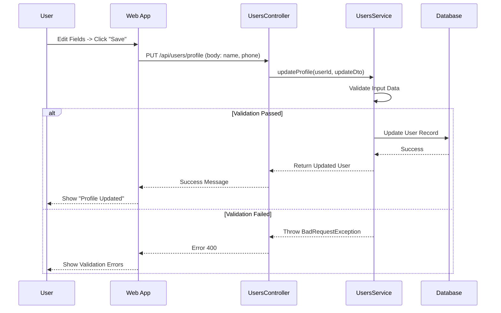

# Profile Management Documentation
-----2.1.2.3-----
## 1. Actors
- **User (Farmer)**: The primary actor who manages their own profile information.

## 2. Use Case Specifications

### UC-PROF-01: Edit Personal Information
| Feature | Description |
| :--- | :--- |
| **Use Case** | **Edit Personal Information** |
| **Actor** | User |
| **Brief Description** | User updates their personal details such as name, phone number, and address. |
| **Pre-conditions** | User is logged in to the system. |
| **Basic Flows** | 1. User navigates to the "Settings" page. 2. System displays current user information. 3. User edits desired fields (e.g., Full Name, Phone Number, Address). 4. User clicks "Save Changes". 5. System validates the input data. 6. System updates the user record in the database. 7. System displays a success message "Profile updated successfully". |
| **Alternative Flows** | **A1. Validation Error:** 1. User leaves required fields empty or enters invalid format (e.g., invalid phone). 2. System displays specific error messages.  **A2. Network/Server Error:** 1. Update request fails due to connection issue. 2. System displays generic error "Could not save changes". |
| **Post-conditions** | User information is updated in the database and reflected in the UI. |

## 3. Sequence Diagrams

### 3.1 Sequence Diagram: Edit Personal Information

