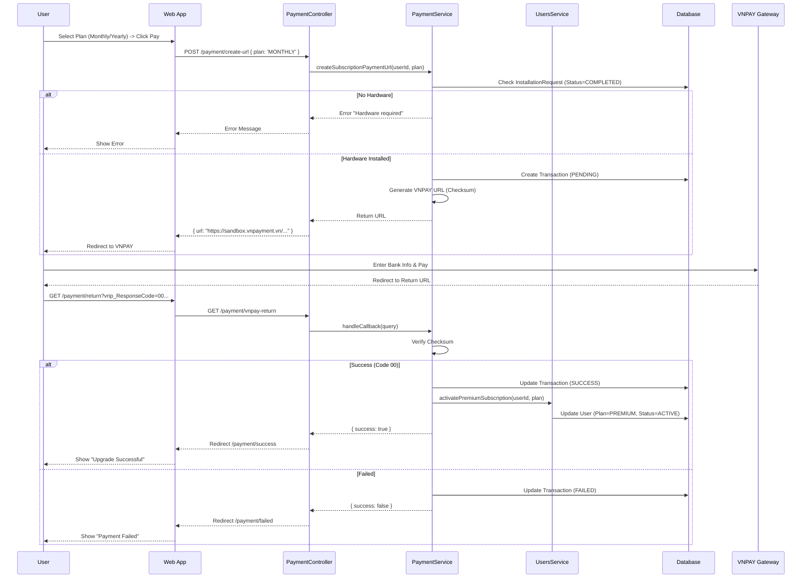

# Subscription Management Documentation
-----2.1.2.10-----
## 1. Actors
- **User (Farmer)**: Registers for Premium Subscription.
- **Web App**: Frontend initiating payment.
- **Payment Service (API)**: Handles payment URL creation, callback verification, and activation.
- **VNPAY Gateway**: External Payment Provider.
- **User Service**: Updates user subscription status.

## 2. Use Case Specifications

### UC-SUB-01: Đăng ký gói trả phí
| Feature | Description |
| :--- | :--- |
| **Use Case** | **Đăng ký gói trả phí** |
| **Actor** | User |
| **Brief Description** | User upgrades account to Premium (Monthly/Yearly) via database payment (VNPAY). |
| **Pre-conditions** | User is logged in. User has completed **Hardware Installation** (validated by `InstallationRequestStatus`). |
| **Basic Flows** | 1. User selects "Upgrade to Premium" on Pricing Page. 2. User chooses Plan (Monthly: 200k, Yearly: 2M). 3. User clicks "Pay with VNPAY". 4. System validates hardware installation. 5. System creates Pending Transaction. 6. System generates VNPAY Payment URL. 7. System redirects User to VNPAY. 8. User completes payment on VNPAY. 9. VNPAY redirects back to `vnpay-return`. 10. System verifies checksum and payment status. 11. System updates Transaction to SUCCESS. 12. System activates Premium Plan for User. 13. Dashboard shows "Premium Active". |
| **Alternative Flows** | **A1. No Hardware:** 1. User tries to upgrade. 2. System checks `InstallationRequest`. 3. System throws Forbidden: "Please install hardware first". 4. UI shows error.  **A2. Payment Failed/Cancelled:** 1. User cancels at VNPAY. 2. VNPAY returns error code. 3. System marks Transaction FAILED. 4. UI shows "Payment Failed". |
| **Post-conditions** | User status becomes `PREMIUM`. Transaction recorded. |

## 3. Sequence Diagrams

### 3.1 Sequence Diagram: Subscribe to Premium (VNPAY Flow)

