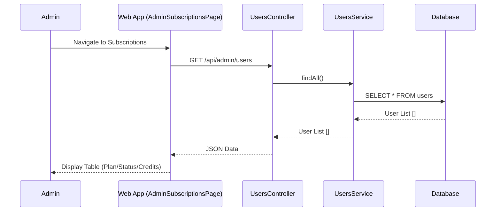
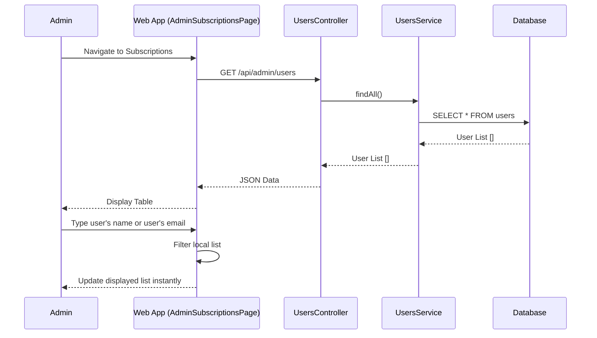
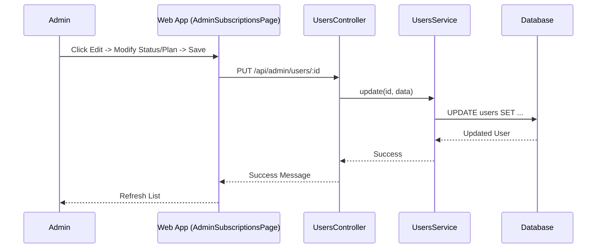

# Subscription Management Documentation
-----2.1.2.18-----
## 1. Overview
The Subscription Management module allows Administrators to manage user subscription plans, statuses, credits, and expiration dates. This is critical for controlling access to Premium features (AI Chat, Advanced Farm Analytics).
## 2. Actors
- **Admin**: Has permissions to modify subscription data.
- **Web App**: The frontend interface for managing subscriptions.
- **System**: The backend API processing requests.
## 3. Use Case Specifications
### UC-SUB-01: View Subscription List
| Feature | Description |
| :--- | :--- |
| **Use Case** | **View Subscription List** |
| **Actor** | Admin |
| **Brief Description** | Admin views a list of users with their current subscription details. |
| **Pre-conditions** | Admin is logged in. |
| **Basic Flows** | 1. Admin navigates to "Quản lý Gói Đăng Ký" (Subscription Management). 2. Web App sends request `GET /api/admin/users`. 3. System retrieves all users. 4. Web App displays list focusing on: User Name, Email, Plan (FREE/PREMIUM), Status (ACTIVE/INACTIVE/TRIAL), Credits, and Expiry Date. |
| **Alternative Flows** | **A1. No Data:** System returns empty list. |
| **Post-conditions** | Subscription list is displayed. |
### UC-SUB-02: Search Subscription
| Feature | Description |
| :--- | :--- |
| **Use Case** | **Search User's Subscription** |
| **Actor** | Admin |
| **Brief Description** | Admin searches for a specific subscription by User Name or Email (Client-side). |
| **Pre-conditions** | Admin is viewing the Subscription List. |
| **Basic Flows** | 1. System has loaded all users. 2. Admin enters a keyword in the Search Bar. 3. Web App filters the displayed list instantly checking: User Name, Email. 4. Web App updates the table to show matching results. |
| **Post-conditions** | List is filtered by keyword. |
### UC-SUB-03: Edit Subscription Status
| Feature | Description |
| :--- | :--- |
| **Use Case** | **Edit Subscription Status** |
| **Actor** | Admin |
| **Brief Description** | Admin manually updates a user's subscription plan, status, credits, or expiry date. |
| **Pre-conditions** | Admin is viewing the Subscription List. |
| **Basic Flows** | 1. Admin clicks "Edit" on a user row. 2. Web App opens "Quản lý gói cước" dialog. 3. Admin updates:    - Plan (FREE/PREMIUM)    - Status (ACTIVE/INACTIVE/TRIAL)    - Credits (Number)    - Expiry Date 4. Admin clicks "Lưu thay đổi" (Save). 5. System updates the user record. 6. Web App refreshes the list with new data. |
| **Alternative Flows** | **A1. Update Failed:** System returns error; UI shows error message. |
| **Post-conditions** | User's subscription data is updated in the Database. |
---
## 4. Sequence Diagrams
### 4.1 Sequence Diagram: View Subscription List

### 4.2 Sequence Diagram: Search Subscription (Client-side)

### 4.3 Sequence Diagram: Edit Subscription Status
