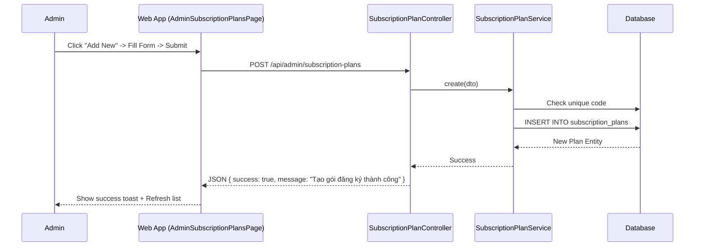
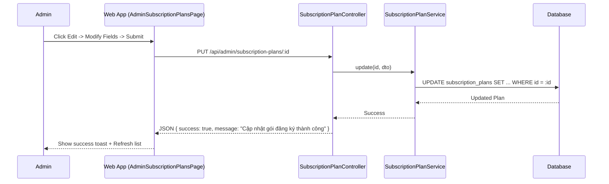
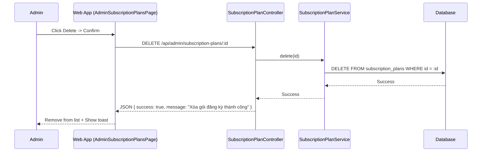

# Subscription Plan Management Documentation
-----2.1.2.19-----
## 1. Overview
The Subscription Plan Management module allows Administrators to create, edit, and delete subscription plan templates. These plans define the pricing, credits, and duration options available to users when purchasing subscriptions.

## 2. Actors
- **Admin**: Has full access to manage subscription plans.
- **Web App**: The frontend interface for plan management.
- **System**: The backend API processing requests.

## 3. Use Case Specifications

### UC-PLAN-03: Create Subscription Plan
| Feature | Description |
| :--- | :--- |
| **Use Case** | **Create Subscription Plan** |
| **Actor** | Admin |
| **Brief Description** | Admin creates a new subscription plan template. |
| **Pre-conditions** | Admin is viewing the Plan List. |
| **Basic Flows** | 1. Admin clicks "Thêm gói mới" (Add New Plan). 2. Web App opens creation dialog. 3. Admin fills in:    - Code (unique, e.g., MONTHLY, YEARLY)    - Name (e.g., "Gói Tháng")    - Description    - Price (VNĐ)    - Credits    - Duration (days)    - Display Order    - Discount Percent    - Badge Text    - Is Popular (checkbox)    - Is Active (checkbox) 4. Admin clicks "Tạo mới" (Create). 5. System validates unique Code. 6. System saves plan to Database. 7. Web App refreshes the list. |
| **Alternative Flows** | **A1. Code Exists:** System returns error; UI shows "Mã gói đã tồn tại". **A2. Invalid Data:** System rejects; UI shows validation errors. |
| **Post-conditions** | New subscription plan is created. |

### UC-PLAN-04: Edit Subscription Plan
| Feature | Description |
| :--- | :--- |
| **Use Case** | **Edit Subscription Plan** |
| **Actor** | Admin |
| **Brief Description** | Admin updates an existing subscription plan. |
| **Pre-conditions** | Admin is viewing the Plan List. |
| **Basic Flows** | 1. Admin clicks "Edit" icon on a plan row. 2. Web App opens edit dialog with current values. 3. Admin modifies fields. 4. Admin clicks "Cập nhật". 5. System updates the plan in Database. 6. Web App refreshes the list. |
| **Alternative Flows** | **A1. Update Failed:** System returns error; UI shows error message. |
| **Post-conditions** | Subscription plan is updated. |

### UC-PLAN-05: Delete Subscription Plan
| Feature | Description |
| :--- | :--- |
| **Use Case** | **Delete Subscription Plan** |
| **Actor** | Admin |
| **Brief Description** | Admin permanently removes a subscription plan. |
| **Pre-conditions** | Admin is viewing the Plan List. |
| **Basic Flows** | 1. Admin clicks "Delete" icon on a plan row. 2. Web App shows confirmation dialog. 3. Admin confirms deletion. 4. System deletes the plan from Database. 5. Web App removes the plan from the list. |
| **Alternative Flows** | **A1. Plan In Use:** System may prevent deletion if plan is referenced by active subscriptions (implementation-dependent). |
| **Post-conditions** | Subscription plan is permanently deleted. |

---

## 4. Sequence Diagrams

### 4.3 Sequence Diagram: Create Subscription Plan

### 4.4 Sequence Diagram: Edit Subscription Plan

### 4.5 Sequence Diagram: Delete Subscription Plan

