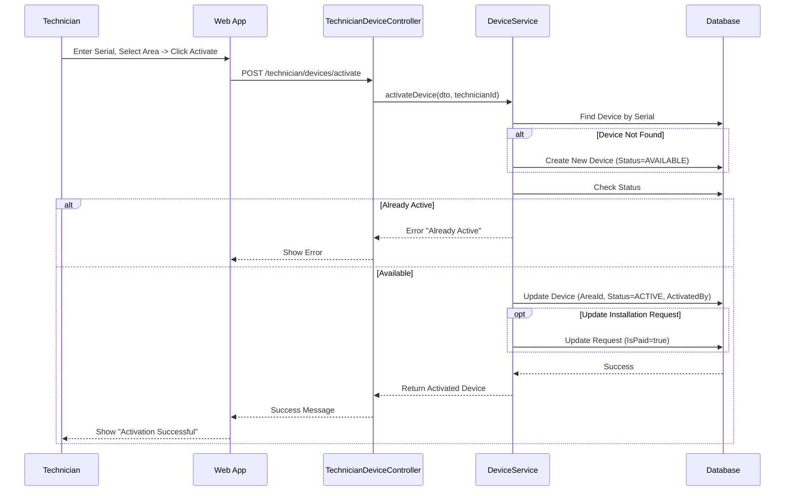

# Technician Device Activation Documentation
-----2.1.2.12-----
## 1. Actors
- **Technician**: Performs physical installation and activates the device in the system.
- **Backend API (NestJS)**: `TechnicianDeviceController`, `DeviceService`.
- **Database**: Updates `Device` and `InstallationRequest` records.

## 2. Use Case Specifications

### UC-TECH-02: Activate Device
| Feature | Description |
| :--- | :--- |
| **Use Case** | **Activate Device** |
| **Actor** | Technician |
| **Brief Description** | Technician links a physical device (Serial Number) to a specific Farm Area and activates it. |
| **Pre-conditions** | Technician is logged in. Device is physically installed. |
| **Basic Flows** | 1. Technician scans/enters **Device Serial Number**. 2. Technician selects **Target Area** (filtered by Installation Assignment). 3. Technician confirms **Hardware Payment** status (if applicable). 4. Technician clicks "Activate". 5. System validates Serial Number (creates new if not exists in inventory). 6. System assigns Device to Area and sets Status = `ACTIVE`. 7. System updates `InstallationRequest` with payment status. 8. System returns success. |
| **Alternative Flows** | **A1. Already Active:** 1. System detects device is already ACTIVE. 2. Error: "Device already active".  **A2. Request Not Found:** 1. Technician tries to link to invalid request. 2. Error: "Invalid Installation Request". |
| **Post-conditions** | Device is online and associated with Farmer's Area. |

## 3. Sequence Diagrams

### 3.1 Sequence Diagram: Activate Device

