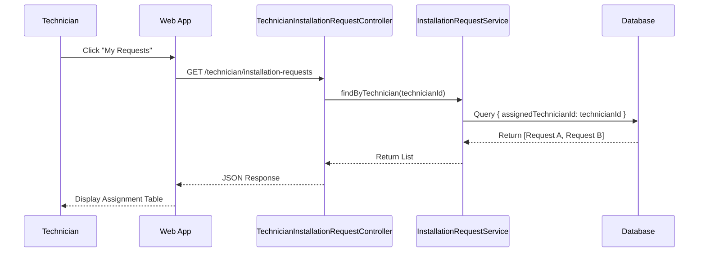

# Technician Request Management Documentation
----2.1.2.11-----
## 1. Actors
- **Technician**: Accesses the "Technician Portal" to view and manage assigned installation jobs.
- **Backend API (NestJS)**: `TechnicianInstallationRequestController`.
- **Database**: Stores `InstallationRequest` records.

## 2. Use Case Specifications

### UC-TECH-01: View Assigned Installation Requests
| Feature | Description |
| :--- | :--- |
| **Use Case** | **View Assigned Installation Requests** |
| **Actor** | Technician |
| **Brief Description** | Technician views the list of installation requests specifically assigned to them by the Admin. |
| **Pre-conditions** | Technician is logged in. Admin has assigned at least one request. |
| **Basic Flows** | 1. Technician navigates to "My Assignments". 2. System filters requests where `assignedTechnicianId == CurrentUser.Id`. 3. System displays list with details (Farm Name, Address, Contact, Status). 4. Technician selects a request to view full details along with Client Notes. |
| **Alternative Flows** | **A1. No Assignments:** 1. System returns empty list. 2. UI shows "No pending assignments". |
| **Post-conditions** | Technician sees relevant jobs. |

## 3. Sequence Diagrams

### 3.1 Sequence Diagram: View Assigned Installation Requests

