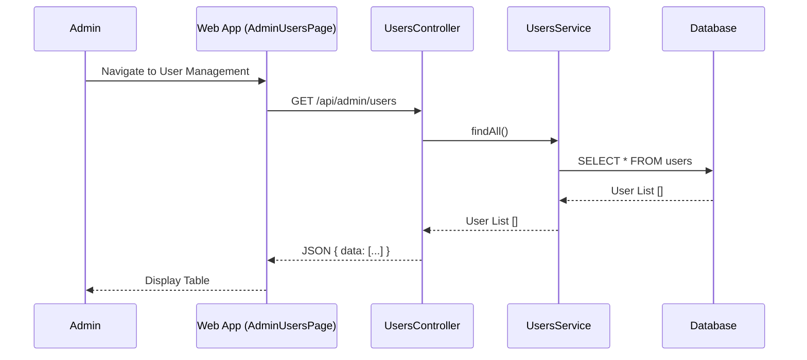
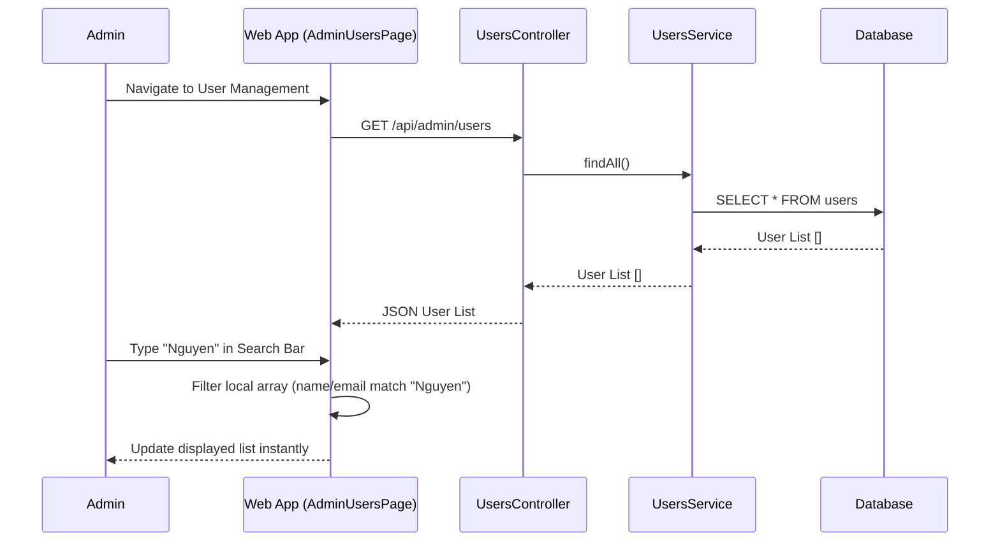
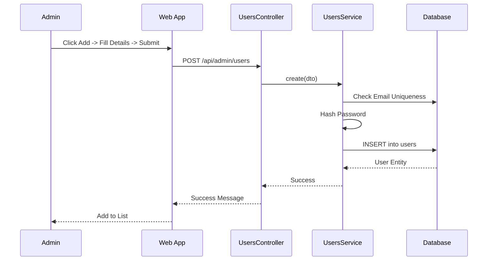
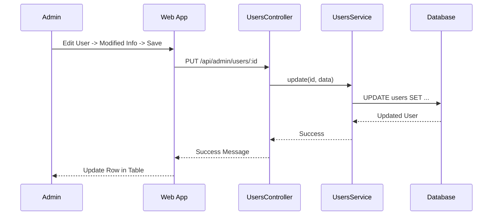
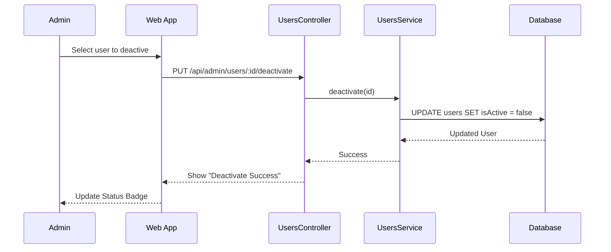
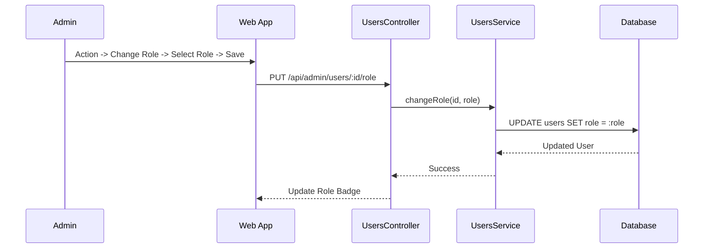
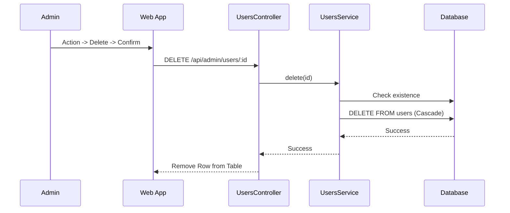

# User Management Documentation
-----2.1.2.16-----

## 1. Overview
The User Management module allows Administrators to manage all accounts in the system, including Farmers and Technicians. Features include creating accounts, updating information, assigning roles, deactivating access, and removing users permanently.

## 2. Actors
- **Admin**: Has full access to manage users.
- **Web App**: The frontend interface for interacting with the system.
- **System**: The backend API processing requests.

## 3. Use Case Specifications

### UC-USR-01: View Account List
| Feature | Description |
| :--- | :--- |
| **Use Case** | **View Account List** |
| **Actor** | Admin |
| **Brief Description** | Admin views the list of all registered users in the system. |
| **Pre-conditions** | Admin is logged in. |
| **Basic Flows** | 1. Admin navigates to the User Management page. 2. Web App sends request to fetch all users. 3. System retrieves user data from Database. 4. Web App displays the list of users including Status and Role. |
| **Alternative Flows** | **A1. No Users:** System returns empty list; UI shows "No users found". |
| **Post-conditions** | List of users is displayed. |

### UC-USR-02: Search Account
| Feature | Description |
| :--- | :--- |
| **Use Case** | **Search Account** |
| **Actor** | Admin |
| **Brief Description** | Admin searches for a Account by Username or Email (Client-side). |
| **Pre-conditions** | Admin is logged in and viewing the User List. |
| **Basic Flows** | 1. System has loaded the User List. 2. Admin enters keyword (Name or Email) in search bar. 3. Web App filters the displayed list instantly regardless of case. *(Note: This is client-side filtering as implemented in `AdminUsersPage`)* |
| **Alternative Flows** | **A1. No Results:** UI displays empty table. |
| **Post-conditions** | Displayed list is filtered matching the keyword. |

### UC-USR-03: Create Account
| Feature | Description |
| :--- | :--- |
| **Use Case** | **Create Account** |
| **Actor** | Admin |
| **Brief Description** | Admin manually adds a new Account to the system. |
| **Pre-conditions** | Admin is logged in. |
| **Basic Flows** | 1. Admin clicks "Add User". 2. Admin enters Email, Password, Full Name, Phone, and Role. 3. Admin clicks "Create". 4. System validates unique Email. 5. System hashes password and saves User. 6. Web App refreshes the list. |
| **Alternative Flows** | **A1. Email Exists:** System returns conflict error; UI shows "Email already exists". |
| **Post-conditions** | New user account is created in Database. |

### UC-USR-04: Edit Account
| Feature | Description |
| :--- | :--- |
| **Use Case** | **Edit Account** |
| **Actor** | Admin |
| **Brief Description** | Admin updates Account's basic information (Name, Phone, Email). |
| **Pre-conditions** | Admin is logged in. |
| **Basic Flows** | 1. Admin selects "Edit" on a user. 2. Admin modifies Name, Phone, or Email. 3. Admin clicks "Save". 4. System updates the record. 5. Web App refreshes the list. |
| **Alternative Flows** | **A1. Invalid Data:** System rejects invalid email format. |
| **Post-conditions** | User information is updated. |

### UC-USR-05: Deactivate Account
| Feature | Description |
| :--- | :--- |
| **Use Case** | **Deactivate Account** |
| **Actor** | Admin |
| **Brief Description** | Admin temporarily disables a user account, preventing login. |
| **Pre-conditions** | Admin is logged in. User is currently Active. |
| **Basic Flows** | 1. Admin selects "Deactivate" from actions menu. 2. Web App sends request to set `isActive = false`. 3. System updates user status. 4. Web App updates status badge to "Inactive". |
| **Alternative Flows** | **A1. Already Inactive:** Action not available or System returns current state. |
| **Post-conditions** | User `isActive` is false; User cannot log in. |

### UC-USR-06: Assign Role (Authorization)
| Feature | Description |
| :--- | :--- |
| **Use Case** | **Assign Role** |
| **Actor** | Admin |
| **Brief Description** | Admin changes a user's role (e.g., Farmer to Technician). |
| **Pre-conditions** | Admin is logged in. |
| **Basic Flows** | 1. Admin selects "Change Role". 2. Admin chooses new Role (ADMIN, FARMER, TECHNICIAN) from dropdown. 3. Admin confirms. 4. System updates user role. 5. Web App reflects the change. |
| **Post-conditions** | User permissions are updated defined by the new Role. |

### UC-USR-07: Delete Account
| Feature | Description |
| :--- | :--- |
| **Use Case** | **Delete Account** |
| **Actor** | Admin |
| **Brief Description** | Admin permanently removes a user and their data. |
| **Pre-conditions** | Admin is logged in. |
| **Basic Flows** | 1. Admin clicks "Delete" icon. 2. Admin confirms warning ("Irreversible action"). 3. System deletes User and cascades to related data (Farms, Requests). 4. Web App removes user from list. |
| **Post-conditions** | User data is permanently removed from Database. |

---

## 4. Sequence Diagrams

### 4.1 Sequence Diagram: View User List

### 4.2 Sequence Diagram: Search Account (Client-side)

### 4.3 Sequence Diagram: Create User

### 4.4 Sequence Diagram: Edit User

### 4.5 Sequence Diagram: Deactivate User

### 4.6 Sequence Diagram: Assign Role

### 4.7 Sequence Diagram: Delete User

