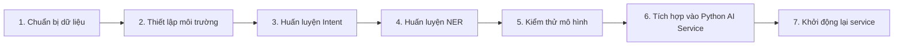

# 🎯 Fine-Tune PhoBERT cho AgriBot (Step-by-Step)

> **Mục tiêu:** huấn luyện (fine-tune) PhoBERT cho bài toán Intent Classification & NER, sử dụng để nâng chất lượng AI chatbot. Tài liệu này dành cho người **không có nền tảng Python**, nên các bước được mô tả chi tiết.

---

## 🧠 Tổng quan luồng chạy



- **Intent model**: Nhận diện câu hỏi thuộc loại nào (doanh thu, thiết bị, kiến thức…).
- **NER model**: Trích xuất entity (ngày, tiền, tên cây, thiết bị…).
- Kết quả fine-tune được đặt vào `apps/python-ai-service/models/...` để service tự dùng.

---

## 0️⃣ Chuẩn bị ban đầu

| Thành phần | Yêu cầu |
|------------|---------|
| Máy tính   | Windows 10/11 (khuyến nghị) |
| Python     | Python 3.10+ (cài đặt sẵn) |
| Công cụ    | Git (tùy chọn), VS Code (khuyến nghị) |
| GPU        | Không bắt buộc (có GPU train nhanh hơn) |
| Dung lượng | ~5 GB trống (model + dữ liệu) |

**Kiểm tra Python:**
```powershell
python --version
```
Nếu chưa có, tải tại https://www.python.org/downloads/ (chọn Add to PATH khi cài).

---

## 1️⃣ Chuẩn bị dữ liệu huấn luyện

### 1.1 Cấu trúc thư mục làm việc

```
ex/
├── apps/
│   └── python-ai-service/
│       ├── models/
│       │   ├── intent_classifier/   (để chứa checkpoint fine-tune intent)
│       │   └── ner_extractor/       (để chứa checkpoint fine-tune NER)
│       ├── train/
│       │   ├── data/                (đặt file CSV huấn luyện)
│       │   └── scripts/             (script huấn luyện)
│       └── ...
```

> Bạn có thể tạo thư mục `train/` để chứa dữ liệu và script. Nếu chưa có, tạo bằng VS Code hoặc File Explorer.

### 1.2 Chuẩn bị dữ liệu Intent

1. Vào `apps/python-ai-service/train/data/` (tạo thư mục nếu chưa có).
2. Tạo file `intent_data.csv` với nội dung mẫu (có thể dựa theo yêu cầu thực tế, càng nhiều câu càng tốt):
   ```csv
   text,label
   "doanh thu tháng này là bao nhiêu",0
   "chi phí tưới tiêu tháng 3",0
   "cách trồng cà chua",1
   "thu hoạch cây bắp khi nào",1
   "bật hệ thống tưới",2
   "tắt máy bơm",2
   "tưới nước cho luống A",3
   "phân tích số liệu farm",4
   "dữ liệu cảm biến nhiệt độ",7
   "tạo bản ghi mới",8
   "cập nhật thông tin farm",9
   "xóa dữ liệu cũ",10
   ```
3. **Mapping label** (đồng bộ với NestJS):

   | Label | IntentType tương ứng |
   |-------|----------------------|
   | 0     | financial_query |
   | 1     | crop_query |
   | 2     | device_control |
   | 3     | activity_query |
   | 4     | analytics_query |
   | 5     | farm_query |
   | 6     | sensor_query |
   | 7     | create_record |
   | 8     | update_record |
   | 9     | delete_record |
   | 10    | knowledge_query (tùy chọn) |

   > Bạn có thể thêm cột `intent_name` để đọc dễ hơn (không bắt buộc). 

### 1.3 Chuẩn bị dữ liệu NER

1. Tạo file `ner_data.jsonl` (mỗi dòng là 1 json record). Ví dụ:
   ```json
   {"text": "Doanh thu tháng 10 là 200 triệu", "entities": [[11, 16, "DATE"], [24, 32, "MONEY"]]}
   {"text": "Tưới nước cho luống A", "entities": [[16, 23, "FARM_AREA"]]}
   {"text": "Bật máy bơm nước", "entities": [[4, 11, "DEVICE"]]}
   ```
   - Cấu trúc `entities`: `[start_index, end_index, entity_type]` theo vị trí trong chuỗi.
   - Các entity types nên khớp `NERExtractor.ENTITY_LABELS` (DATE, MONEY, CROP, AREA, DEVICE, ACTIVITY, METRIC).

> Nếu chưa có dữ liệu thật, có thể tạm dùng dữ liệu mẫu (ít nhất 50-100 câu mỗi intent/entity).

---

## 2️⃣ Thiết lập môi trường (Windows)

### 2.1 Tạo virtual environment (khuyến nghị)

```powershell
cd apps/python-ai-service

# Tạo virtualenv (nếu chưa có)
python -m venv venv

# Kích hoạt
venv\Scripts\activate
```

Sau khi kích hoạt, prompt sẽ có dạng `(venv) C:\...`.

### 2.2 Cài dependencies

Trong môi trường đã kích hoạt:
```powershell
pip install --upgrade pip
pip install -r requirements.txt

# Nếu thiếu thư viện cho training, cài thêm:
pip install transformers datasets torch pandas scikit-learn numpy accelerate evaluate seqeval
```

> Nếu máy không có GPU, `torch` sẽ tự cài bản CPU (chạy chậm hơn).

---

## 3️⃣ Huấn luyện Intent Classification (Local)

### 3.1 Tạo script training

1. Tạo file `apps/python-ai-service/train/scripts/train_intent.py` với nội dung mẫu:
   ```python
   import pandas as pd
   from datasets import Dataset
   from sklearn.model_selection import train_test_split
   import torch
   from transformers import AutoTokenizer, AutoModelForSequenceClassification, Trainer, TrainingArguments

   # Đường dẫn dữ liệu & nơi lưu model
   DATA_PATH = "../data/intent_data.csv"
   OUTPUT_DIR = "../../models/intent_classifier"

   df = pd.read_csv(DATA_PATH)

   # Tách train/validation
   train_texts, val_texts, train_labels, val_labels = train_test_split(
       df['text'], df['label'], test_size=0.2, random_state=42, stratify=df['label']
   )

   tokenizer = AutoTokenizer.from_pretrained("vinai/phobert-base")

   def tokenize(batch):
       return tokenizer(batch['text'], truncation=True, padding='max_length', max_length=256)

   train_dataset = Dataset.from_dict({"text": train_texts, "label": train_labels})
   val_dataset = Dataset.from_dict({"text": val_texts, "label": val_labels})

   train_dataset = train_dataset.map(tokenize, batched=True)
   val_dataset = val_dataset.map(tokenize, batched=True)

   train_dataset = train_dataset.rename_column("label", "labels")
   val_dataset = val_dataset.rename_column("label", "labels")

   model = AutoModelForSequenceClassification.from_pretrained(
       "vinai/phobert-base", num_labels=df['label'].nunique()
   )

   training_args = TrainingArguments(
       output_dir=OUTPUT_DIR,
       evaluation_strategy="epoch",
       save_strategy="epoch",
       learning_rate=2e-5,
       per_device_train_batch_size=8,
       per_device_eval_batch_size=8,
       num_train_epochs=4,
       weight_decay=0.01,
       load_best_model_at_end=True,
       metric_for_best_model="accuracy",
   )

   def compute_metrics(eval_pred):
       import numpy as np
       from datasets import load_metric
       metric = load_metric("accuracy")
       logits, labels = eval_pred
       predictions = np.argmax(logits, axis=-1)
       return metric.compute(predictions=predictions, references=labels)

   trainer = Trainer(
       model=model,
       args=training_args,
       train_dataset=train_dataset,
       eval_dataset=val_dataset,
       tokenizer=tokenizer,
       compute_metrics=compute_metrics,
   )

   trainer.train()
   trainer.save_model(OUTPUT_DIR)
   tokenizer.save_pretrained(OUTPUT_DIR)
   ```

2. Chạy script:
   ```powershell
   cd apps/python-ai-service/train/scripts
   python train_intent.py
   ```
3. Kết quả: Checkpoint được lưu tại `apps/python-ai-service/models/intent_classifier/`.

---

## 4️⃣ Huấn luyện NER (PhoBERT Token Classification)

### 4.1 Script mẫu

Tạo `apps/python-ai-service/train/scripts/train_ner.py`:
```python
import json
import os
from datasets import Dataset,
from sklearn.model_selection import train_test_split
from transformers import AutoTokenizer, AutoModelForTokenClassification, DataCollatorForTokenClassification, Trainer, TrainingArguments

DATA_PATH = "../data/ner_data.jsonl"
OUTPUT_DIR = "../../models/ner_extractor"

# Load data jsonl
def load_dataset(path):
    texts, entities = [], []
    with open(path, "r", encoding="utf-8") as f:
        for line in f:
            item = json.loads(line)
            texts.append(item["text"])
            entities.append(item["entities"])
    return texts, entities

texts, entities = load_dataset(DATA_PATH)

# Tokenizer & label mapping
label_list = ["O", "B-DATE", "I-DATE", "B-MONEY", "I-MONEY", "B-CROP", "I-CROP", "B-AREA", "I-AREA", "B-DEVICE", "I-DEVICE", "B-ACTIVITY", "I-ACTIVITY", "B-METRIC", "I-METRIC"]
label_to_id = {label: i for i, label in enumerate(label_list)}

model_name = "vinai/phobert-base"
tokenizer = AutoTokenizer.from_pretrained(model_name)

# Convert entity annotations sang label sequence cho từng token (phức tạp hơn intent)
# Để đơn giản, bạn có thể dùng các thư viện hỗ trợ (ví dụ: seqeval), hoặc tham khảo script trong huggingface.
# Ở đây, khuyến nghị sử dụng notebook mẫu trong HuggingFace course: "Token Classification".

# => Nếu bạn cần script cụ thể hơn, xem tài liệu đi kèm (FINE_TUNING_GUIDE.md) để copy script chi tiết.

```

> Huấn luyện NER phức tạp hơn vì phải map entity theo token. Nếu bạn chưa quen, ưu tiên tham khảo notebook chuẩn của HuggingFace: https://huggingface.co/transformers/tasks/token_classification và chuyển toàn bộ bước thực thi sang môi trường local bằng Python venv ở trên.

### 4.2 Gợi ý nhanh (nếu không muốn tự code)

- Sử dụng **notebook chính thức** của HuggingFace cho token classification (bạn chỉ cần thay dữ liệu của mình):
  - https://github.com/huggingface/notebooks/blob/main/examples/token_classification.ipynb
- Thay `model_name = "vinai/phobert-base"`.
- Chỉnh `label_list` theo entity của AgriBot.
- Sau khi train xong, download folder `ner_extractor` và đặt vào `apps/python-ai-service/models/ner_extractor/`.

---

## 5️⃣ Kiểm thử mô hình đã fine-tune

### 5.1 Intent

Tạo script `apps/python-ai-service/train/scripts/test_intent.py`:
```python
from transformers import AutoTokenizer, AutoModelForSequenceClassification
import torch

MODEL_PATH = "../../models/intent_classifier"

tokenizer = AutoTokenizer.from_pretrained(MODEL_PATH)
model = AutoModelForSequenceClassification.from_pretrained(MODEL_PATH)

INTENT_LABELS = [
    "financial_query", "crop_query", "device_control",
    "activity_query", "analytics_query", "farm_query",
    "sensor_query", "create_record", "update_record",
    "delete_record", "knowledge_query"
]

def predict_intent(text):
    inputs = tokenizer(text, return_tensors="pt", truncation=True, max_length=256)
    with torch.no_grad():
        outputs = model(**inputs)
        probs = torch.softmax(outputs.logits, dim=-1)
        idx = torch.argmax(probs, dim=-1).item()
        confidence = probs[0][idx].item()
    return INTENT_LABELS[idx], confidence

samples = [
    "Doanh thu tháng này là bao nhiêu",
    "Bật hệ thống tưới",
    "Cách trồng cà chua"
]

for text in samples:
    intent, conf = predict_intent(text)
    print(f"{text} -> {intent} ({conf:.2f})")
```

Chạy:
```powershell
python test_intent.py
```

### 5.2 NER

Nếu đã fine-tune NER, tạo `test_ner.py`:
```python
from transformers import AutoTokenizer, AutoModelForTokenClassification
import torch

MODEL_PATH = "../../models/ner_extractor"

label_list = ["O", "B-DATE", "I-DATE", "B-MONEY", "I-MONEY", "B-CROP", "I-CROP", "B-AREA", "I-AREA", "B-DEVICE", "I-DEVICE", "B-ACTIVITY", "I-ACTIVITY", "B-METRIC", "I-METRIC"]

tokenizer = AutoTokenizer.from_pretrained(MODEL_PATH)
model = AutoModelForTokenClassification.from_pretrained(MODEL_PATH)

text = "Thuê nhân công tốn 10 triệu trong tháng 9"
inputs = tokenizer(text, return_tensors="pt", return_offsets_mapping=True)
with torch.no_grad():
    outputs = model(**inputs)
    predictions = torch.argmax(outputs.logits, dim=-1)[0]

offset_mapping = inputs["offset_mapping"][0]
result = []
for idx, pred in enumerate(predictions):
    label = label_list[pred.item()]
    if label != "O":
        start, end = offset_mapping[idx]
        result.append({
            "label": label,
            "text": text[start:end],
            "position": (start, end)
        })

print(result)
```

---

## 6️⃣ Tích hợp vào Python AI Service

1. Đảm bảo các checkpoint đã được copy đúng:
   - `apps/python-ai-service/models/intent_classifier/` chứa `config.json`, `pytorch_model.bin`, `tokenizer.json`, ...
   - `apps/python-ai-service/models/ner_extractor/` tương tự.

2. `IntentClassifier.load_model()` và `NERExtractor.load_model()` đã có logic kiểm tra đường dẫn fine-tune. Nếu thấy log “Fine-tuned model not found” nghĩa là thư mục rỗng hoặc sai đường dẫn.

> Nếu bạn muốn chỉ rõ đường dẫn khác, chỉnh trong file `apps/python-ai-service/src/models/intent_classifier.py` & `ner_extractor.py` (biến `fine_tuned_path`).

---

## 7️⃣ Khởi động lại Python AI Service

```powershell
cd apps/python-ai-service
venv\Scripts\activate
python src/main.py
```

Log kỳ vọng:
```
📦 Loading Intent Classifier (PhoBERT)...
Loading fine-tuned model from ./models/intent_classifier...
📦 Loading NER Extractor (PhoBERT)...
Loading fine-tuned model from ./models/ner_extractor...
🎉 Python AI Service ready!
```

Test nhanh:
```powershell
curl -X POST http://localhost:8000/intent/classify ^
  -H "Content-Type: application/json" ^
  -d "{\"text\": \"Doanh thu tháng này bao nhiêu\"}"
```
Dự kiến trả về `financial_query` với confidence cao >0.8.

---

## ❓ FAQ nhanh

| Câu hỏi | Giải đáp |
|---------|----------|
| **Không có GPU, train được không?** | Được, nhưng chậm hơn. Dữ liệu nhỏ vẫn train ổn (10-50 phút). |
| **Dữ liệu ít có train được không?** | Có thể bắt đầu với 20-50 câu mỗi intent/entity. Càng nhiều dữ liệu càng chính xác. |
| **Cần bao lâu?** | Chuẩn bị + train intent: ~30 phút. NER phức tạp hơn: 1-2 giờ (nếu không quen). |
| **Lưu mô hình ở đâu?** | `apps/python-ai-service/models/intent_classifier/` và `models/ner_extractor/`. |
| **Service vẫn cảnh báo fallback?** | Kiểm tra lại thư mục checkpoint và chắc chắn service chạy trong cùng môi trường. |

---

## ✅ Checklist hoàn thành

- [ ] Cài Python & kích hoạt virtualenv
- [ ] Chuẩn bị `intent_data.csv` & (tuỳ chọn) `ner_data.jsonl`
- [ ] Cài dependencies training
- [ ] Chạy `train_intent.py`
- [ ] (Tuỳ chọn) Chạy `train_ner.py` hoặc notebook HuggingFace (local)
- [ ] Copy checkpoint vào `apps/python-ai-service/models/...`
- [ ] Test với `test_intent.py` / `test_ner.py`
- [ ] Khởi động lại Python service & kiểm tra

Chúc bạn huấn luyện thành công! 🚀 Nếu cần script mẫu chi tiết hơn, bạn có thể xem thêm tại `FINE_TUNING_GUIDE.md` hoặc liên hệ team DevOps hỗ trợ.
